# 常用API文档

--------

#### 介绍

列举类中常用的方法

------

#### String

> - 非静态方法
>
>   > - charAt()
>   > - codePointAt()
>   > - offsetByCodePoints()
>   > - compareTo()
>   > - codePoints()
>   > - empty()
>   > - blankK()
>   > - equals()
>   > - equalsIgnoreCase()
>   > - startsWith()
>   > - endsWith()
>   > - indexOf()
>   > - lastIndexOf()
>   > - length()
>   > - codePointCount()
>   > - replace()
>   > - substring()
>   > - toLowerCase()
>   > - toUpperCase()
>   > - trim()
>   > - strip()
>   > - join()
>   > - repeat()
>
> 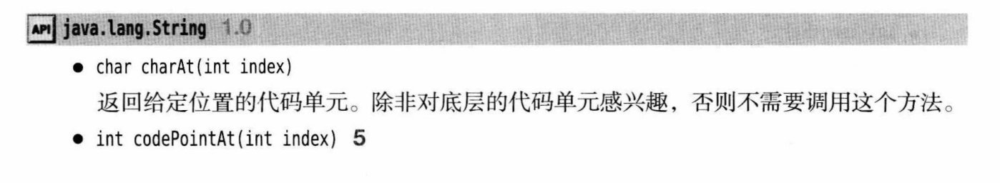
>
> 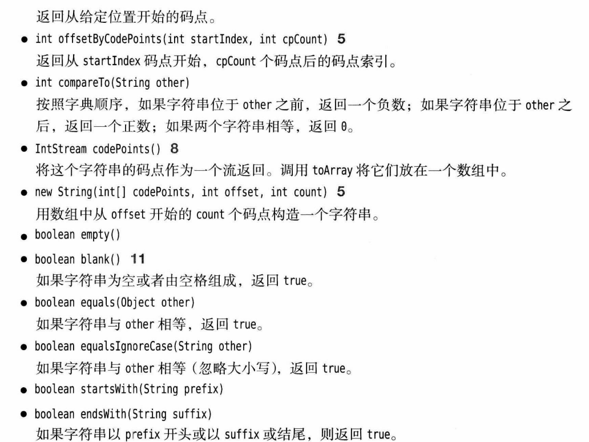
>
> 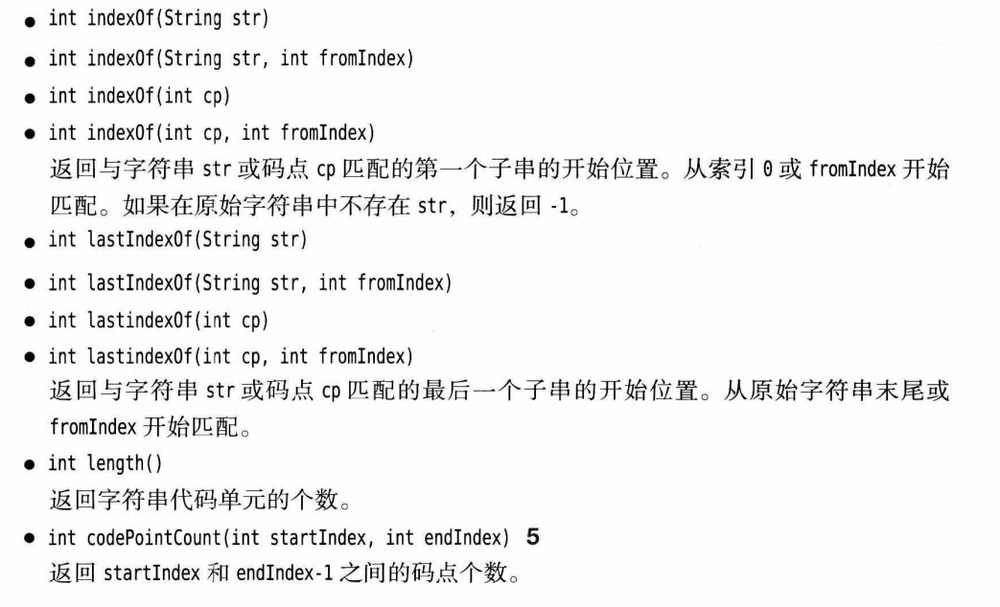
>
> 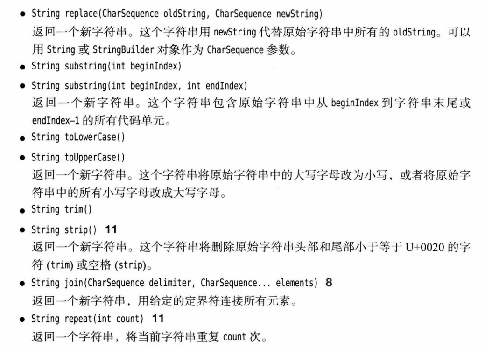

------

#### StringBuilder

> - 非静态方法
>
>   > - length()
>   > - append()
>   > - appendCodePoint()
>   > - setCharAt()
>   > - insert()
>   > - delete()
>   > - toString()
>
> 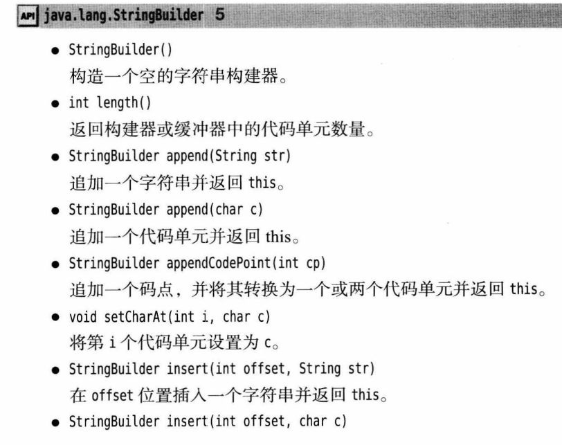
>
> 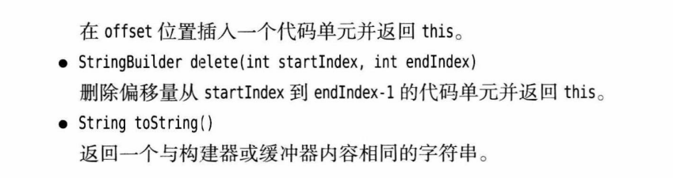

----------------

#### Arrays

> - 静态方法
>
> > - toString()
> > - copyOf()
> > - copyOfRange()
> > - sort()
> > - binarySearch()
> > - fill()
> > - equals()
>
> 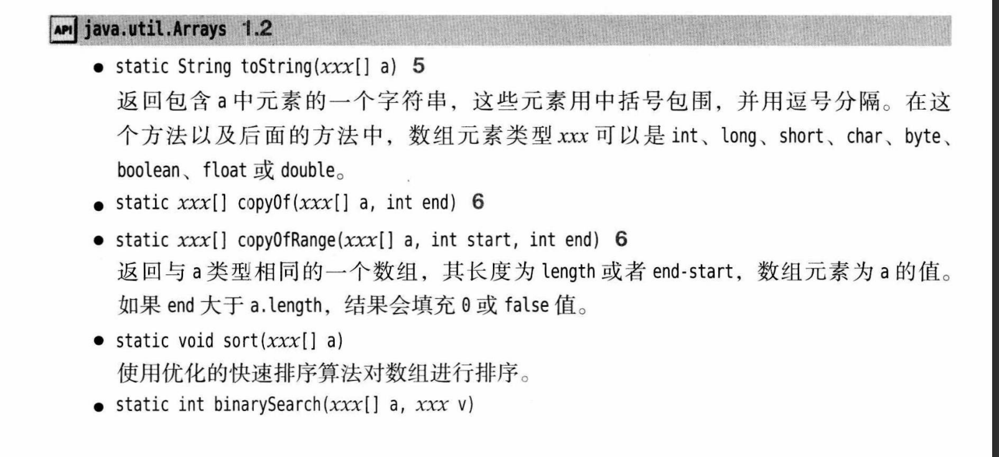
> 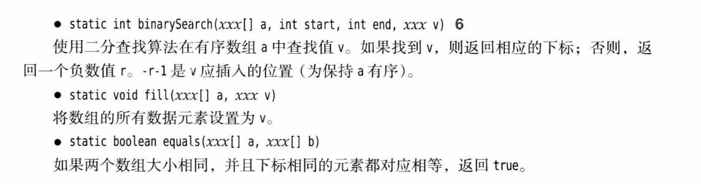

------------

#### Objects

> - 静态方法 
>
> > - requireNonNull()
> > - requireNonNullElse()
> > - requireNonNullElseGet()
>
> 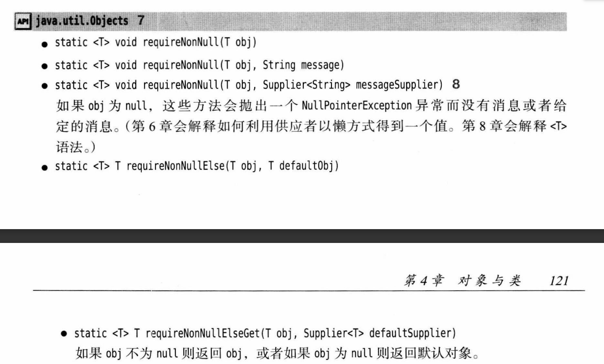

--------

#### Random

> - 非静态方法
>
> > - Random()
> > - nextInt()
>
> 

-----

#### Scanner

> - 非静态方法
>
>   > - nextLine()
>   > - next()
>   > - nextInt()
>   > - nextDouble()
>   > - hasNext()
>   > - hasNextInt()
>   > - hasNextDouble()
>
>   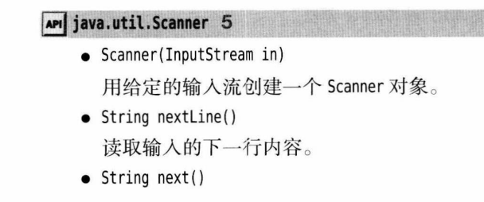
>
>   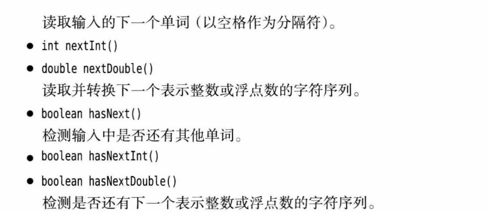
>
>   

----

#### Console

> - 静态方法
>
>   > - readPassword()
>   > - readLine()
>
> 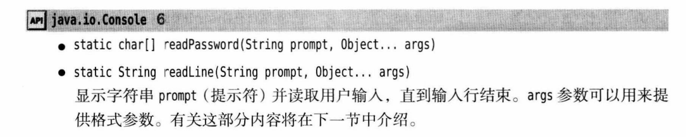

-----

#### System

> - 静态方法
>
>   > - console()
>
> 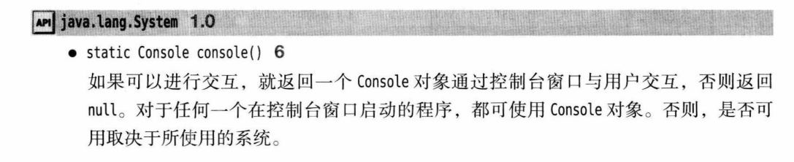

---------

#### Path

> - 静态方法
>
>   > - of()
>
> 

----

#### BigInteger

> - 非静态方法
>
>   > - add
>   > - subtract()
>   > - multiply()
>   > - divide()
>   > - mod()
>   > - sqrt()
>   > - compareTo()
>   > - valueOf()
>
> - 静态方法
>   - valueOf()
>
> 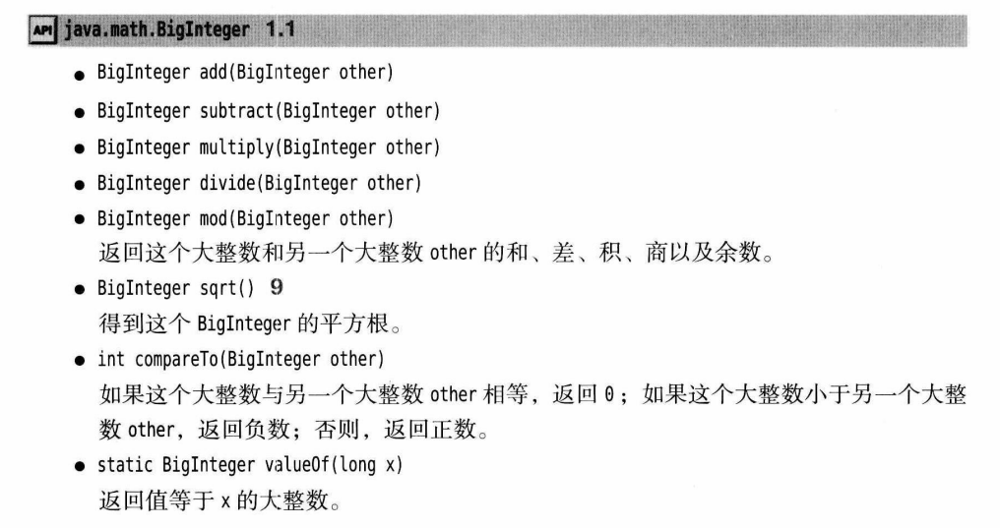

---

#### BigDecimal

> - 非静态方法
>
>   > - add()
>   > - subtract()
>   > - multiply()
>   > - divide()
>   > - compareTo()
>
> - 静态方法
>
>   > - valueOf()
>
> 
>
> 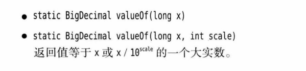

---------