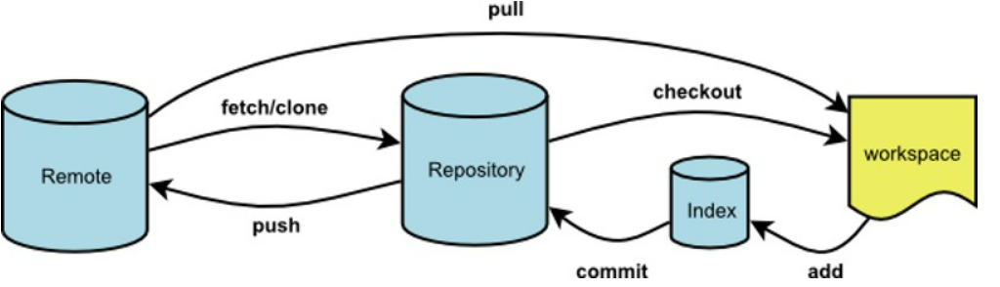

# Git

---



学习git网站
[超详细讲解Git](https://zhuanlan.zhihu.com/p/30044692)
## Git相关文件
>  [Git文件详解](https://blog.csdn.net/mayfla/article/details/78653396)

- .gitconfig ---git的配置文件
- .bash_history  ---使用过的命令行历史记录
- .bash_profile
- .bashrc  ---简化命令
- .gitignore  ---忽略某些文件不提交


为常用指令配置别名

> 在用户目录下创建.bashrc文件,并在里面编写简化的指令

```
#用于输出git提交日志
alias git-log='git log --pretty=oneline --all --graph --abbrev-commit'
```

### 常见问题

---

使用cat 命令时乱码

```
#目前解决方案只能临时解决
cat 文件名 | iconv -f GBK -t UTF-8
```

### 命令
----

查看文件前后差异

```
git diff 文件名
```

设置用户信息

```
#""中的内容可以为任意值
git config --global user.name"用户名"
git config --global user.email"用户邮箱"
```

查看配置信息

```
git config --global user.name
git config --global user.email
```


初始化仓库

```
git init  
```
查看提交日志

``` 
git log 
```
 
查看提交版本号

```

git reflog
```

查看文件提交状态

```
git status  
```

将工作区的文件加暂存区

```

git add 文件名  
```

将工作区全部的问文件加入暂存区

```

git add .  
```

将暂存区的文件加入本地仓库

```

git commit -m “注释内容” 
```

版本回退

> commitID可以通过 git log 或 git reflog 查询

```

git reset --hard commitID
```

回到上一个版本

```
git reset --hard HEAD^

```

回到上n个版本

```

git reset --hard HEAD~n
```


#### 分支

----

移动或者重命名当前分支

```java
git branch -M 新分支名
```

查看全部的分支

```java
git branch
```

创建分支

````java
git branch 分支名
````

删除分支

```java
git branch -d 分支名
```

强制性删除分支

> 需要在别的分支执行该命令，不能在需要删除的分支执行该命令

```java
git branch -D 分支名
```

查看本地分支与远程分支的关联情况

```java
git branch -vv
```

切换分支

```java
git checkout 分支名
```

创建并且切换分支

```java
git checkout -b 分支名
```

合并分支

```git
git merge 分支名
```

显示分支关联关系

```git
git show-ref
```

#### 远程

----

查看本地仓库相关联的全部的远程仓库

> 一个本地仓库可以关联多个远程仓库

```git

git remote
```

查看更详细的远程仓库信息

```

git remote -v
```

将本地仓库与远程仓库关联

> 远程仓库代称可以是任何名字，一般命名为origin

```git
git remote add 远程仓库代称 远程仓库地址
```

将本地仓库的文件上传到远程仓库

```git
git push  -u 远程仓库代称 远程仓库分支
```

将本地仓库分支与远程仓库分支关联

> 关联之后将本地仓库文件上传到远程仓库可以使用 
>
> ```git
> git push
> ```
>
> 远程仓库分支名一定要与本地仓库分支名相同

```git
git push --set-upstream 远程仓库代称  远程仓库分支
```

克隆仓库

```git
git clone 远程仓库地址
```

更新本地仓库

> 将远程仓库的更新添加到本地仓库，不执行合并操作  ，若无远程仓库分支参数，则将远程仓库全部分支添加到本地仓库

```git
git fetch 远程仓库代称 [远程仓库分支]
```

> 将远程仓库的更新添加到本地并且执行合并操作,相当于git fetch 与 git merge一起用

```git
git pull
```

### SSH公钥

-----

```
#生成ssh key
ssh-keygen -t ed25519 -C "sshkey名称"
（按照提示连续点击三次回车，即可生成ssh key）
#查看ssh key
cat ~/.ssh/id_ed25519.pub
（将生成的ssh key 添加到远程仓库的主机中）
# 将远程仓库主机添加本机SSH可信列表
ssh -T git@gitee.com
（Hi XXX! You've successfully authenticated, but Gitee.com does not provide shell access. 内容，则证明添加成功。）
```
