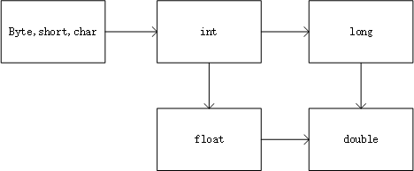

# 牛客刷题知识积累

---------------

#### 介绍

这是我在牛客上刷Java相关的题得到的知识点与评论区中优秀的评论

-------------

[TOC]

-------------

#### 包装类

> 基本类型之间比较，会将低精度类型自动转换为高精度类型再比较

> - 数据缓存( [-128]到[127] Byte Short Integer Long  [0]到[127] Character )
>
>   > - 当**封装类**与**基本数据类型**进行比较(` ==与equals`)时，会自动拆箱 (`XXValue()`)  内容相同全为true		
>   > - 当**封装类**与**封装类**进行比较时，直接赋值会自动装箱（`valueOf()`）在范围内内容相同为true

--------------------

- 重载  （发生在同一个类中）
     - 同名不同参
     - 对返回值与访问修饰符没有限制

- 正则表达式

  | 符号  |            含义            |
  | :---: | :------------------------: |
  |   ^   |          起始符号          |
  |   $   |          结束符号          |
  | [n-m] | 表示n到m范围内中的一个数字 |
  |  \d   |      表示任何一个数字      |
  | X{m}  |          表示m个X          |
  |  \s   |      表示匹配空白字符      |
  |       |                            |


----------------------

#### 内部类

> - 成员内部类
> - 局部内部类
> - 匿名内部类 
> - 静态内部类

 1.**成员内部类**
>
> （1）该类像是外部类的一个成员，可以无条件的访问外部类的所有成员属性和成员方法（包括private成员和静态成员）；
>
> （2）成员内部类拥有与外部类同名的成员变量时，会发生隐藏现象，即默认情况下访问的是成员内部类中的成员。如果要访问外部类中的成员，需要以下形式访问：【外部类.this.成员变量 或 外部类.this.成员方法】；
>
> （3）在外部类中如果要访问成员内部类的成员，必须先创建一个成员内部类的对象，再通过指向这个对象的引用来访问；
>
> （4）成员内部类是依附外部类而存在的，也就是说，如果要创建成员内部类的对象，前提是必须存在一个外部类的对象；
>
> （5）内部类可以拥有private访问权限、protected访问权限、public访问权限及包访问权限。如果成员内部类用private修饰，则只能在外部类的内部访问；如果用public修饰，则任何地方都能访问；如果用protected修饰，则只能在同一个包下或者继承外部类的情况下访问；如果是默认访问权限，则只能在同一个包下访问。外部类只能被public和包访问两种权限修饰。
>
​	2.**局部内部类**
>
> （1）局部内部类是定义在一个方法或者一个作用域里面的类，它和成员内部类的区别在于局部内部类的访问仅限于方法内或者该作用域内；
>
> （2）局部内部类就像是方法里面的一个局部变量一样，是不能有public、protected、private以及static修饰符的。
>
​	3.**匿名内部类**
>  Lambda表达式生成的匿名内部类不会生成字节码文件
>
> 用于方法参数、方法返回值、变量初始化
>
> （1）一般使用匿名内部类的方法来编写事件监听代码；
>
> （2）匿名内部类是不能有访问修饰符和static修饰符的，变量只能被*final* 修饰；
>
> （3）匿名内部类用于继承其他类或是实现接口，并不需要增加额外的方法，**只是对继承方法的实现或是重写**。
>
​	4.**静态内部类**
>
> （1）静态内部类是不需要依赖于外部类的，这点和类的静态成员属性有点类似；
>
> （2）不能使用外部类的非static成员变量或者方法。

-----------------------

#### 运算符

---

取模运算
> 在Java中小数与整数都可以参与取模运算

位运算符
> 在Java中只有无符号右移运算符(>>>)，没有无符号左移运算符

逗号运算符 
> 只存在于for循环中


```java
int i,j;
for(i=1,j=2;;)
```
- switch(x) x的数据类型
```java
byte short int  char  enum  类 
```

  - 类型转换

      - 自动转换，不需要强转

    

     - 小类型到大类型自动转换

     - 大类型到小类型需要手动强转
     - 给包装类赋值需要明确的数据类型，整数默认类型为int,浮点数默认类型为double

     - final 类型变量进行计算时不会进行类型转换，计算结果看右边类型

     - 在进行运算时，byte 、short、char会自动转换为int

     - +=会将表达式中的变量自动强转

     - 三目运算符会进行自动类型转换和自动拆箱（自动拆箱的缺点）

       ``` Java
       	//在进行运算时，byte 、short、char会自动转换为int    
           byte a=2,b=4;
        	byte c=a+b;//编译出错
       	int i=a+b;//编译正确
       	
       	//+=会将表达式中的变量自动强转
       	a+=b//编译正确+
        	a=a+b;//编译错误
       
       	Integer integer=null;
       	System.out.println(true?integer:1.0)//编译不出错，但运行时NPE
           System.out.println((double)integer)//反编译结果，先自动拆箱再自动类型转换
           System.out.println(true?1:1.0)//输出1.0 int类型的1转换为double类型的1.0
               
           //final 类型变量进行计算时不会进行类型转换，计算结果看右边类型（自动强转）
           final byte b1=1,b2=2;
       	byte b=b1+b2;
       	int  i=b1+b3;
       ```

      	

- 变量
  - 局部变量（赋值时才创建变量--分配空间）
  - 成员变量
    - 实例变量（无static修饰的变量）
    - 静态变量（类变量）

- 计算优先级
  
  - 以字符串为分界符，字符串前面的正常计算，字符串后面的当作字符拼接，有括号先计算括号里的

- 方法

  - 静态方法

    - 静态方法中不能出现this和super关键字

  - 实例方法

  - 抽象方法

    

    

- Java中创建对象的四种方式

  - 使用new关键字创建对象

  - 使用反射创建对象

  - 使用克隆创建对象

  - 使用反序列化创建对象

    ```java
      //通过构造器获得对象
            Object o1=new Object();//通过new关键字获得对象
            Object o2 = Object.class.getDeclaredConstructor().newInstance();//通过反射获得对象
            //通过内存获得对象
            Object o = new ObjectInputStream(new FileInputStream("需要获得对象的文件路径"))
                    .readObject();//通过反序列化获得对象  //通过构造器获得对象
            Object o1=new Object();//通过new关键字获得对象
            Object o2 = Object.class.getDeclaredConstructor().newInstance();//通过反射获得对象
            //通过内存获得对象
            Object o = new ObjectInputStream(new FileInputStream("需要获得对象的文件路径"))
                    .readObject();//通过反序列化获得对象
    ```

    

- Java中方法参数传递为值传递

```java
 public static void main(String[] args) {
        String str = "hrc";
        string(str);
        System.out.println(str);//输出结果为 hrc
        StringBuilder sb = new StringBuilder(str);
        System.out.println(sb);//输出结果为 hrc
        stringBuilder(sb);
        System.out.println(sb);//输出结果为 hrchut
    }
   
    public static void string(String str) {
        str = "hrc";
    }

    public static void stringBuilder(StringBuilder sb) {
        sb.append("hut");
    }
```

------------------

#### 异常

- try-catch  try-finally  try-catch-finally  异常处理只有这三种形式
- instanceof  二元运算符，用来判断左边的对象是否为右边类的子类，接口或抽象类的实现类
```java
        Object o = new Object();
        if (o instanceof String) {
            String str = (String) o;
            System.out.println("该对象是其子类或其子类的实例对象，并且将该对象强转为String类");
        }
        //Java14、15为preview版，Java16为正式版
        if (o instanceof String str) {
            System.out.println("该对象是其子类或其子类的实例对象，并且将该对象强转为String类");
        }
```

------

#### 泛型

```java
        //引入泛型原始的写法
        ArrayList<String> arrayList1 = new ArrayList<String>();
        //Java7写法
        ArrayList<String> arrayList2 = new ArrayList<>();
        //Java10的写法，只能用于局部变量,且必须初始化(数据类型只能为引用类型）和不能复合声明变量即一次只能声明一个变量
        var arrayList3 = new ArrayList<String>();
        //反编译字节码文件中写法
        ArrayList<String> arrayList4=new ArrayList();
```

-----------

#### API

> - Math
>
>   > - round()
>   > - floor()
>   > - ceil()
>
> ````java
>  round(x) 返回值为 x+0.5 floor(x+0.5)  向下取整
>  floor  地板 向下取整
>  ceil  天花板 向上取整
> ````
>
> - System
>
>   > - 静态方法
>   >   - arraycopy()
>   >   - copyOf()
>
>   ```java
>   //当目标数组容量大于等于源数组时使用
>   public static native void arraycopy(Object src,  int  srcPos,
>                                           Object dest, int destPos,
>                                           int length);
>   //底层使用System.arraycopy,但是无需手动创建目标数组
>    public static <T,U> T[] copyOf(U[] original, int newLength, Class<? extends T[]> newType)
>   ```

---------

#### 类的加载顺序

> 先加载静态资源，且遵循先父后子原则
>
> ----
>
> - 细节
>
>   > 创建对象时不会加载静态资源，而是将非静态资源全部加载一遍，因为创建对象之前，类在进入方法区的时候会加载全部的静态资源。类没有加载到方法区，无法创建对象。
>
> - 如果类还没有被加载： 
>   1、先执行父类的静态代码块和静态变量初始化，并且静态代码块和静态变量的执行顺序只跟代码中出现的顺序有关。 
>   2、执行子类的静态代码块和静态变量初始化。 
>   3、执行父类的实例变量初始化 
>   4、执行父类的构造函数 
>   5、执行子类的实例变量初始化 
>   6、执行子类的构造函数 
> - 如果类已经被加载： 
>   则静态代码块和静态变量就不用重复执行，再创建类对象时，只执行与实例相关的变量初始化和构造方法

--------------------

- 加载器
  - 启动类加载器（Bootstrap ClassLoader)
  - 扩展类加载器（Extension ClassLoader)
  - 应用程序类加载器(Application ClassLoader)又称系统类加载器

------------

#### 继承

子类继承父类的东西

> 子类继承了父类的全部字段和方法，但是没有private方法和字段的访问权限。没有继承父类的构造器，静态初始化与实例初始化。

> - 构造器
>
>   > - 子类中的父类有参构造器必须在子类构造器的第一行
>   > - 父类没有空参构造器
>   >   - 拥有有参构造器
>   >     - 子类构造器中必须显性的调用父类的有参构造器
>   >   - 没有有参构造器
>   >     - 编译器为父类加上空参构造器
>   >     - 子类构造器隐性调用父类的无参构造器
>   > - 父类拥有空参构造器
>   >   - 子类构造器随意
>
> - 重写方法的规则（两同两小一大）（发生在继承关系中)
>    
>    > - 两同：方法名和参数列表必须相同
>    > - 两小：返回值或声明异常比父类小（或相同）
>    > - 一大：访问修饰符比父类大（或相同）
>    > - 注意：重写接口中的方法的访问修饰符只能为public
>    
> - 父类的public/protected final方法子类不能覆盖  只有private final方法可以覆盖
>
> - 对象为子类，调用的方法从子类向父类层层去找方法   this 为调用者

----------------------

#### 接口与抽象类

> - 接口
>
>   > - 接口之间可以多继承
>   > - 变量修饰符默认且只能为public static final
>   > - 方法 默认修饰符为public abstract
>   >   - JDK 1.7  public abstract 抽象方法
>   >   - JDK 1.8 添加 public static 静态方法  public default 默认方法
>   >   - JDK 1.9 添加 private 私有方法
>
> - 抽象类
>
>   > - 相当于普通类+接口的组合，就是不能实例化

--------------------------

#### 计算机基础

编码
> 在Java中一律采用Unicode编码方式，每个字符无论是中文还是英文字符都占用2个字节。
>  在Java中class文件统一采用Unicode编码，char固定2字节，但在JVM中char类型采用UTF-16 big endian(大端存储)。
> GBK: 中文2字节  字母1字节
> UTF-8 : 中文 3字节  字母1字节

- 位运算符
    - 按位与`&`

    - 按位非`~` ~n=-n-1

    - 按位或`|`

    - 按位异或`^`

      > 任何数字与本身进行异或操作结果为0，任何数字与0进行异或操作结果为本身  a ^ a = 0   a ^ 0 = a 
 ```java
 在计算机中数字参与运算使用的是补码--机器码，真值--原码，输出的结果为真值
     补码+1=反码 整数的原码、反码、补码相等 最高位为符号位0为整数1为负数
int a=5;//0000 0000 0000 0101
int b=-3;//1111 1111 1111 1101 //1111 1111 1111 1100 // 1000 0000 0000 0011
按位与（&）运算符在两个操作数对应的二进位都为 1 时，该位的结果值才为 1。有0则为0 
   a&b=1;//0000 0000 0000 0101
按位非（~）将操作数的位反转。0变为 1 ，1 变为 0。
    //是用公式 ~n=-n-1  -5-1
    ~a=-6;//1111 1111 1111 1010补码  //1111 1111 1111 1001反码  //1000 0000 0000 0110原码
	~b=2 ;//0000 0000 0000 0010  
按位或（|）运算符在其中一个或两个操作数对应的二进制位为 1 时，该位的结果值为 1。有1则为1
    a|b=-3 //1111 1111 1111 1101
按位异或（^）相同为0，不同为1
   	a^b= -8;//1111 1111 1111 1000 //1111 1111 1111 0111 //1000 0000 0000 1000
    
 ```

--------------

#### 数据结构

> - HashMap
>
>   > - jdk8之前为数组+链表，jdk8之后为数组+链表+红黑树
>   > - 数组是主体，链表和红黑树是为了解决哈希冲突存在的

- 哈希冲突

当两个对象的hashcode相同时需要调用重写的equals()来判断是否发生哈希冲突。即如果两个对象的内容相同，则它们的hashcode相同，但是不同内容也可能hashcode相同，这就是哈希冲突。不直接调用重写的equals()是因为往往重写的equals()效率太低

- HashMap与Hashtable的区别
1. 继承不同
2. HashMap方法不同步，而Hashtable方法同步
3. HashMap允许有null,而Hashtable不允许有null
4. 遍历的内部实现不同
5. 哈希值使用不同
6. 数组的初始大小不同 HashMap-16-一定是2的指数 Hashtable-11 

#### 多态

---

> 静态方法不存在重写，只能被覆盖，子类与父类具有相同的静态方法时，这属于两个方法

>  非静态方法  编译看左边，运行看右边，子类若重写执行子类的方法，为重写，执行父类的方法

> 字段   编译看左边，运行看左边，无法使用子类的字段，只能使用父类的字段

#### 加载驱动的方法

> 加载驱动就是加载各厂商对JDBC规划实现的类

1. 调用方法Class.forName()
2. 通过添加系统的jdbc.drivers属性
3. 调用方法DriverManager.registerDriver()

``` java

   public static void jdbc() throws ClassNotFoundException, SQLException {
        //加载驱动的三种方法
        String url = null;
        String driverName = "com.mysql.cj.jdbc.Driver";
        String sqlString = null;
        String result = null;
        //加载驱动--将实现jdbc规范的类加载到方法区
        //调用方法Class.forName()
        //通过添加系统的jdbc.drivers属性
         System.setProperty("jdbc.drivers",driverName);
         //调用DriverManager.registerDriver方法注册
//        DriverManager.registerDriver(new com.mysql.jdbc.Driver());
        //创建连接
        Connection connection = DriverManager.getConnection(url,"root","root");
        //通过连接获得statement
        Statement statement = connection.createStatement();
        //执行sql语句
        ResultSet resultSet = statement.executeQuery(sqlString);
        while (resultSet.next()) {
              result = resultSet.getString(1);
            System.out.println(resultSet);
        }
```

#### 获得字节码对象的三种方式

- 通过调用Class.forName()获取
- 通过类名.class获取
- 通过对象.getClass()获取

#### IO

- 节点流

> 对具体地方的数据进读写(磁盘，内存)
- 处理流

> 将节点流作为参数，也称为包装流
  - BufferedInputStream BufferedOutputStream
  - BufferedReader BufferedWriter
  - DataInputStream DataOutputStream
  - InputStreamReader OutputStreamWriter (转换流)

#### Web

- HttpServletResponse接口

设置HTTP头标

```java
response.setHeader("Refresh","3");//三秒刷新一次页面
response.addHeader(String name, date);
```

设置cookie

```java
response.addCookie(new Cookie("username","only"));
```

输出返回结果

```java
response.getOutPutStream.write();
```

- HttpServletRequset接口

读取路径信息

```java
request.getRealPath("url");//虚拟路径映射为实际目录
request.getRealPath("./");//网页所在的目录
request.getRealPath("../");//网页所在的目录的上一层目录
request.getContextPath();//应用的Web目录名称
```

#### JSP

内置对象(9)

- request
- response
- session
- application
- out
- pageContext
- config
- page
- execption

#### Java并发

- CopyOnWriteArrayList类

  > 使用ReentrantLock类进行加锁，对add()加锁。适用于读多写少的并发场景。写时复制，创建新的list加入写的内容，再将旧的引用指向新的list，这个过程相当耗时，写多的情况不推荐。

- ReadWriteLock接口

  > 适用于读多写少的并发场景。

- ConcurrentHashMap类

  > 读操作不需要加锁，写操作需要加锁。

- volatile关键字

  > volatile只保证线程在"加载数据阶段"加载的数据是最新的，不能保证线程安全性。

- 锁

  - synchronized修饰非静态方法锁的是this对象,修饰静态方法锁的是Class对象
  - 同步代码块锁的是任意对象

- Java用监视器机制实现了线程之间的同步执行

- 进程同步器

  > 同步器是一些使线程能够等待另外一个线程的对象，允许它们协调工作。常用的同步器是CountDownLatch和Semaphore

  - Semaphore类

    > 信号量。用于表示共享资源数量。用acquire()获取资源，用release()释放资源。

  - CyclicBarrier类

    > 线程到达屏障后等待，当一组线程都到达屏障后才一起恢复执行。

  - CountDownLatch类

    > 初始时给定一个值，每次调用countDown()值减一，当值为零时阻塞的线程恢复执行。
  
  问答题
  
  ---
  
  >  Callable接口与Runnable接口
  
  **区别**
  
  Callable接口的call()可以具有返回值和抛出异常，Runnable接口的run()没有返回值和不能抛出异常。
  
   实现Callable接口的线程存放在FutureTask类中，实现Runnable接口的线程存放在Thread类中。
  
  **相同点**
  
  线程都是使用Thread类的start()开启线程。
  
  

