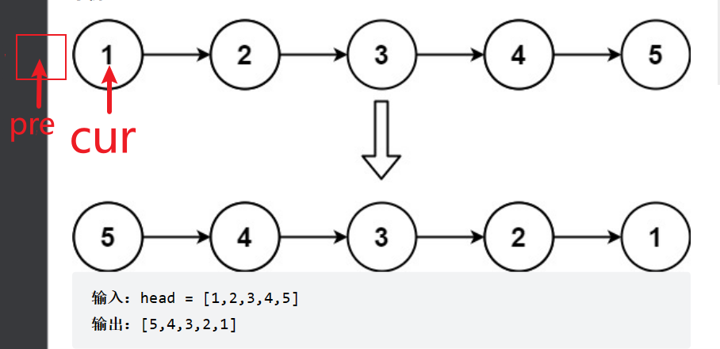

# 反转链表

- 题目

[206. 反转链表 - 力扣（LeetCode）](https://leetcode.cn/problems/reverse-linked-list/submissions/)

- 思路

使用双指针(pre、cur)直接反转指向

- 图解

- 代码

```java
ListNode pre=null;//当前指针的前一个节点
ListNode cur=head;//指向当前节点
while(cur!=null){
    ListNode temp=cur.next;//临时存储当前节点的后和一个节点
    cur.next=pre;
    pre=cur;
    cur=temp;
}
return pre;
```

