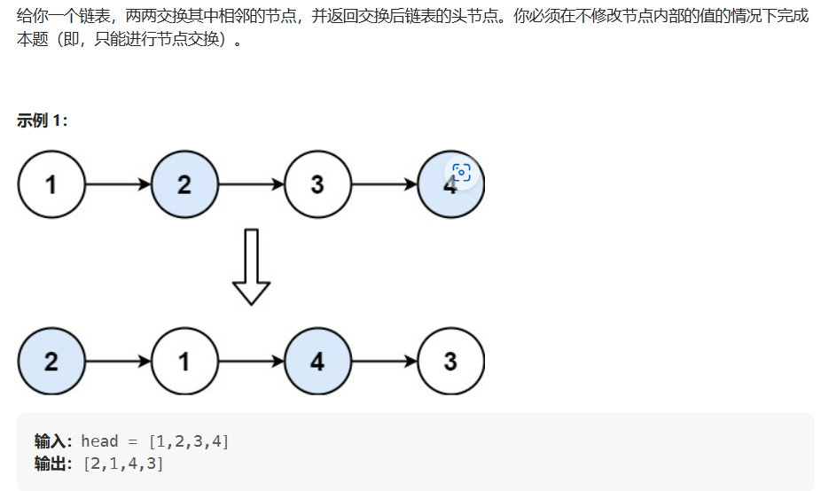

# 交换链表中的节点

- 题目

[24. 两两交换链表中的节点 - 力扣（Leetcode）](https://leetcode.cn/problems/swap-nodes-in-pairs/)

- 思路

使用虚拟头节点(dummyHead)，然后使用两个临时指针(temp1、temp2)，一个遍历指针(cur)。

首先，temp1指向第一个节点，temp2指向第三个节点(可以为null)，dummyHead指向第一个节点，cur指向dummyHead；然后cur指向第二个节点,第二个节点指向temp1，temp1再指向temp2;最后判空条件为cur.next!=null&&cur.next.next!=null

- 题图

- 代码

```java
ListNode dummyHead=new ListNode();
dummyHead.next=head;
ListNode cur=dummyHead;
while(cur.next!=null&&cur.next.next!=null){
    ListNode temp1=cur.next;
    ListNode temp2=cur.next.next.next;
    cur.next=temp1.next;
    cur.next.next=temp1;
    temp1.next=temp2;
    cur=cur.next.next;
}
return dummyHead.next;
```

