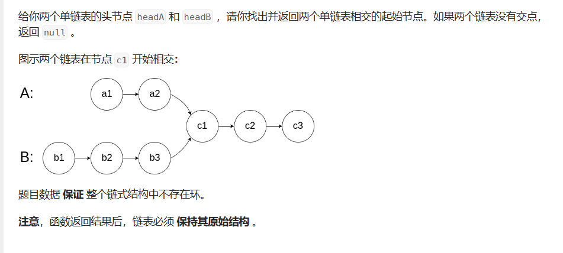

# 链表相交

- 题目

[面试题 02.07. 链表相交 - 力扣（Leetcode）](https://leetcode.cn/problems/intersection-of-two-linked-lists-lcci/description/)

- 思路

> 两条链表长度相同时，在相交节点前的节点个数相同



- 代码

```java
ListNode cur1=headA;
listNode cur2=headB;
int lenA=getLen(cur1);
int lenB=getLen(cur2);
int i=lenA-lenB;
if(i<0){
    i=-i;
    ListNode temp=cur1;
    cur1=cur2;
    cur2=temp;
}
while(i--!0){
    cur1=cur1.next;
}
while(cur1!=null){
    if(cur1==cur2)
        return cur1;
    cur1=cur1.next;
    cur2=cur2.nexr;
}
return null;
```

