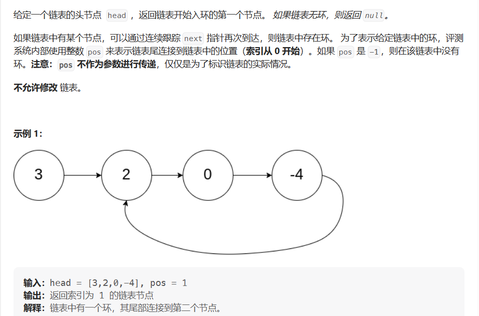

# 环形链表

- 题目

[142. 环形链表 II - 力扣（Leetcode）](https://leetcode.cn/problems/linked-list-cycle-ii/description/)

- 思路

> 一道数学题，记住结论---从起始点与相遇点以相同的速度出发，再次相遇的节点为入环点
>
> 方法为双指针法



- 代码

```java
ListNode fast = head;
ListNode low = head;
while (fast != null && fast.next != null) {
    //快指针的速度是慢指针的两倍
    fast = fast.next.next;
    low = low.next;
    if (fast = low) {
        //相遇点
        ListNode index1 = fast;
        //起始点
        ListNode index2 = head;
        while (index1 != index2) {
            index1 = index1.next;
            index2 = index2.next;
        }
        return index1;
    }
}
return null;
```

