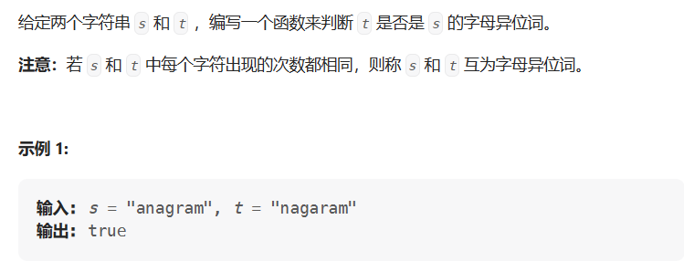

# 有效的字母异位词

---

- 题目

[242. 有效的字母异位词 - 力扣（LeetCode）](https://leetcode.cn/problems/valid-anagram/description/)

- 思路

> 使用HashMap，利用其主键不能相同的特性去重。主键记录出现的字母，值记录出现字母的次数，若最后出现字母的次数为0，则就是字母异位词。



- 代码

```java
import java.util.*;
HashMap<Character,Integer> hashMap=new HashMap<>();
for(int i=0;i<s.length();i++){
    char ch=s.charAt(i);
    if(hashMap.contains(ch)){
        Integer value=hashMap.get(ch);
        hashMap.put(ch,++value);
    }else
        hashMap.put(ch,1);
  for(int i=0;i<t.length;i++){
      char ch=t.charAt(i);
      if(hashMap.contains(ch)){
          Integer value=hashMap.get(ch);
          hashMap.put(ch,--value);
      }else
          return false;
  }
    Collection values=hashMap.values();
    for(Integer value: values){
        if(value!=0)
            return false;
    }
    return true;
}
```

- 失误

刷题记得导包