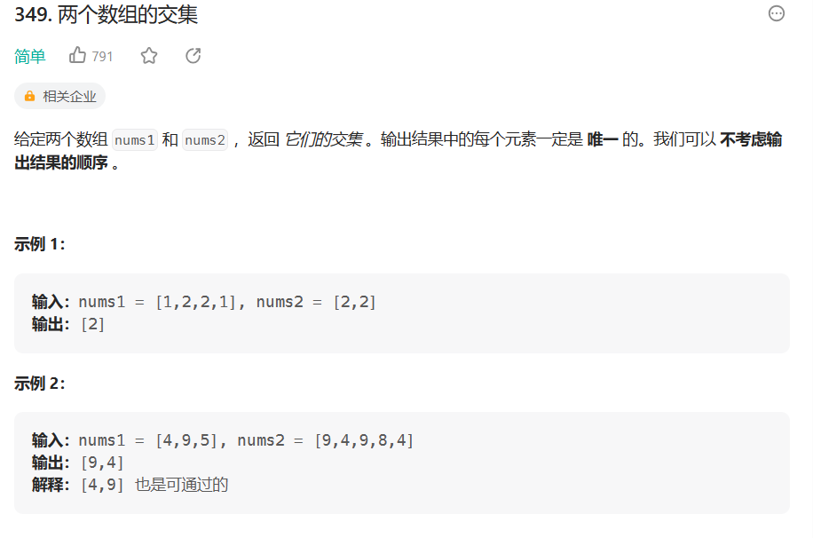

# 两个数组的交集

- 题目

[力扣（LeetCode）官网 - 全球极客挚爱的技术成长平台](https://leetcode.cn/problems/intersection-of-two-arrays/submissions/)

-  思路

> 利用HashSet的元素不重复特性可以完成去重,再利用stream流转换为数组



- 代码

```java
var hs1=new HashSet<Integer>();
var hs2=new HashSet<Integer>();
for(int x : nums1){
    hs1.add(x);
}
for(int x : nums2){
    if(hs1.contains(x)){
        hs2.add(x);
    }
}
return hs2.stream().mapToInt(x->x).toArray();
```

