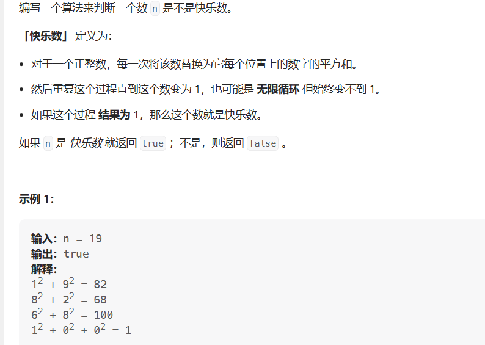

# 判断是否为快乐数

- 题目

[202. 快乐数 - 力扣（LeetCode）](https://leetcode.cn/problems/happy-number/description/)

- 思路

> 通过不断取模和除于10，获得数字的每一位。



```java

boolean solve(){
    var hs=HashSet<Integer>();
while(n!=1&& !hs.contains(n)){
    hs.add(n);
    n=handle(n);
}
    return n===1;
}
int handle(int n){
    int res=0;
    while(n>0){
        int temp=n%10;
        res+=temp*temp;
        n/=10;
    }
    return res;
}
```

