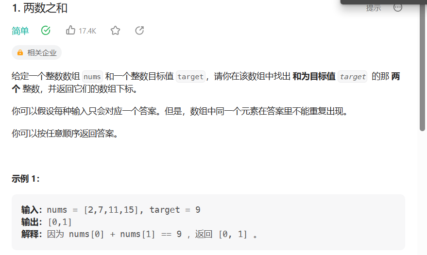

# 两数之和

- 题目

[1. 两数之和 - 力扣（LeetCode）](https://leetcode.cn/problems/two-sum/)

- 思路

> 利用两个数之间存在某个关系，将其中一个数用另外一个数来表示,然后在集合中查询是否存在



- 代码

```java
int[] solve(){
    int[] res = new int[2];
    var hm = new HashMap<Integer,Integer>();
    for(int i = 0;i < nums.length;i++){
        int temp = target - nums[i];
        if(hm.containsKey(temp)){
            res[0] = hm.get(temp);
            res[1] = i;
            break;
        }
        hm.put(temp,i);
    }
    return res;
}
```

