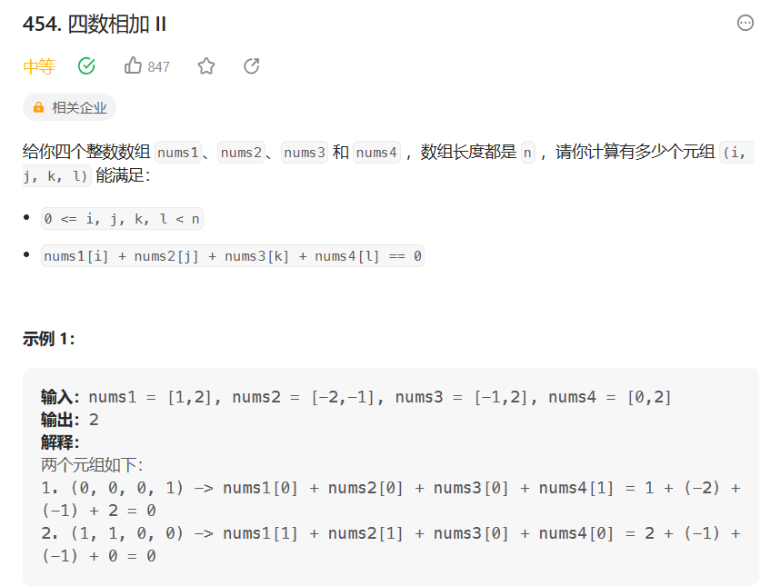

# 四数相加

- 题目

[454. 四数相加 II - 力扣（LeetCode）](https://leetcode.cn/problems/4sum-ii/description/)

- 思路

>  将前两组数组中的每个元素两两相加作为键存入HashMap，并且将相加的结果出现次数作为值存入HashMap。最后将后两组数组的每个元素两两相加，然后将相加的结果的相反数当作键，在HashMap中进行查询，若查询到则将该键的值与res相加。



- 代码

```java
public int solve() {
    int res = 0;
    var Hm = new HashMap<Integer,Integer>();
    for (int i = 0; i < nums1.length; i < i++) {
        for (int j = 0; j < nums2.length; j++) {
            int sum = nums1[i] + nums2[j];
            if (hm.contains(sum)) {
                int count = hm.get(sum);
                hm.put(sum,++count);
            } else {
                hm.put(sum,1);
            }
        }
    }
    for (int i = 0; i < nums3.length; i++) {
        for (int j = 0; j < nums4.lenght; j++) {
            int sum = nums3[i] + nums4[j];
            if (hm.contains(-sum)) {
                int count = hm.get(-sum)；
                    res += count;
            }
        }
    }
    return res;
}
```

- 失误

> hm.put(sum,count++)  与 hm.put(sum,++count) 是有区别的，在传值的时候自增运算符的前后会对结果产生影响。