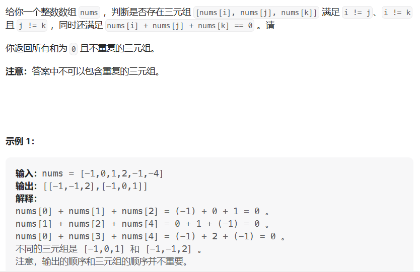

# 三数之和

- 题目

[15. 三数之和 - 力扣（LeetCode）](https://leetcode.cn/problems/3sum/description/)

- 难点

> 如何去除重复的三元组。

- 思路

> 本题可以使用双指针法表示后两个数。首先，对原数组进行排序。然后第一个元素去重，如果第一个元素等于前一个元素代表结果集中已存在该三元组直接寻找下一个第一个元素；第二个元素与第三个元素去重，如果指针下个元素与当前指针元素相等，则指针移动到下一个元素。将三个元素添加到结果集中一定在对第二个和第三个元素去重之前。



```java
public List<List<Integer>> solve() {
    //结果集
    var res = new ArrayList<List<Integer>>();
    //对原数组进行排序，对去重有很大帮助
    Arrays.sort(nums);
    //nums[i] 表示第一个元素 nums[left]表示第二元素 nums[right]表示第三个元素
    for (int i = 0; i < nums.length; i++) {
        if (nums[i] > 0) return res;
        //对第一个元素去重  
        if (i > 0 && nums[i] == nums[i-1]) continue;
        int left = i + 1;
        int right = nums.length - 1;
        while (left < right) {
            int sum = nums[i] + nums[left] + nums[right];
            if (sum > 0) right--;
            else if (sum < 0) left ++;
            else {
                //一定要先进行添加操作再去重，不然会少三元组
                res.add(Arrays.asList(nums[i], nums[left], nums[right]));
                //对第二个元素去重
                while (left < right && nums[left] == nums[left+1]) left++;
                while (left < right && nums[right] == nums[right - 1]) right--;
                left++;
                right--;
            }
        }
    }
    return res;
}
```

