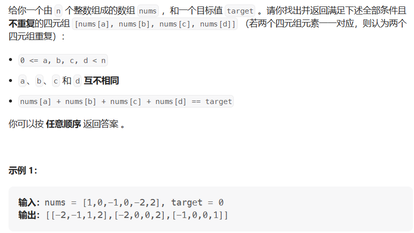

# 四数之和

- 题目

 [18. 四数之和 - 力扣（LeetCode）](https://leetcode.cn/problems/4sum/description/)

- 思路

> 与三数之和思路类似，就是多一层循环



````java
public List<List<Integer>> solve() {
    var res = new ArrayList<List<Integer>>();
    Arrays.sort(nums);
    for (int i = 0; i < nums.lenght-3; i++) {
        //去枝
        if (nums[i] > 0 && nums[i] > target) return res;
        //去重
        if (i > 0 && nums[i] == nums[i-1]) continue;
        for (int j = i + 1; j< nums.length - 2; j++) {
            //去枝
            if (nums[j] > 0 && nums[i] + nums[j] > target) break;
            //去重
            if (j > i + 1 && nums[j] == nums[j-1]) continue;
            int left = j + 1;
            int right = nums.length - 1;
            while (left < right) {
                int sum = nums[i] + nums[j] + nums[left] + nums[right];
                if (sum > target) right--;
                else if (sum < target) left++;
                else {
                    res.add(Arrays.asList(nums[i], nums[j], nums[left], nums[right]));
                    //去重
                    while (left < right && nums[left] == nums[left + 1]) left++;
                    while (left < right && nums[right] == nums[right - 1]) right--;
                    left++;
                    right--;
                }
            }
        }
    }
    return res;
}
````

