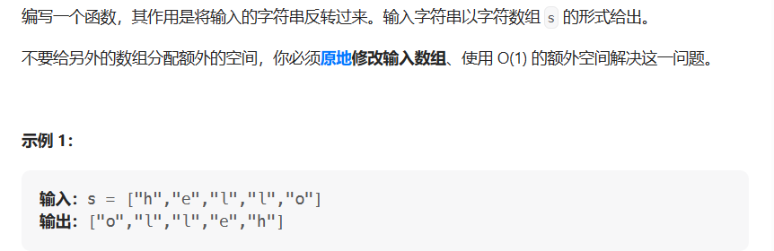

# 反转字符串

- 题目

[344. 反转字符串 - 力扣（LeetCode）](https://leetcode.cn/problems/reverse-string/)

- 思路

> 使用双指针法，首字符与尾字符交换使用异或操作



- 代码

```java
public void solve(char[] s) {
    int left = 0;
    int right = s.length - 1;
    while (left < right) {
        s[left] ^= s[right];
        s[right] ^= s[left];
        s[left] ^= s[right];
        left++;
        right--;
    }
}
```

