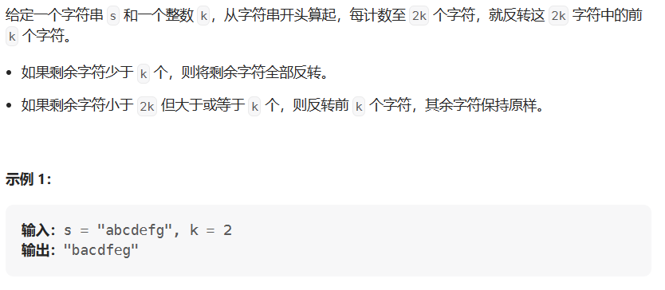

# 反转字符串

- 题目

[541. 反转字符串 II - 力扣（LeetCode）](https://leetcode.cn/problems/reverse-string-ii/description/)

- 思路

> 反转某段区间的字符串



```java
public String solve(String s, int k) {
    var chars = s.toCharArray();
    for (int i = 0; i < s.length(); i += 2 * k) {
        reverse(chars, i, Math.min(s.length, i + k) - 1);
    }
}
public void reverse(char[] chars, int left, int right) {
    while (left < right) {
        chars[left] ^= chars[right];
        chars[right] ^= chars[left];
        chars[left] ^= chars[right];
        left++;
        right--;
    }
}
```

- 失误

> 认真审题，求反转一段区间的字符串