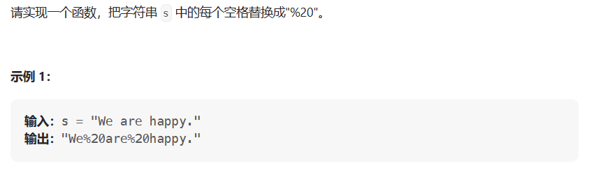

# 替换空格

- 题目

[剑指 Offer 05. 替换空格 - 力扣（LeetCode）](https://leetcode.cn/problems/ti-huan-kong-ge-lcof/description/)

- 思路

>  使用StringBuilder容器，遍历字符串s，若字符为空格则向容器中添加替换字符，否则添加该字符



- 代码

```java
public String solve(String s) {
    var sb = new StringBuilder();
    for (int i = 0; i < s.length(); i++) {
        char ch = s.charAt(i);
        if (ch == ' ') sb.append("%20");
        else sb.append(ch);
    }
    return sb.toString();
}
```

