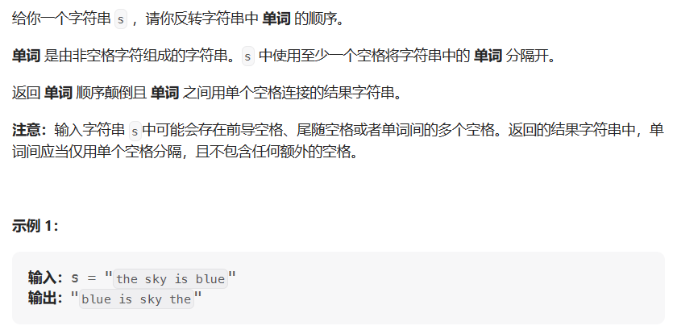

# 反转字符串中的单词

- 题目

[151. 反转字符串中的单词 - 力扣（LeetCode）](https://leetcode.cn/problems/reverse-words-in-a-string/)

- 思路

  > 首先将多余的空格删除，然后将字符串整体反转，最后将字符串中的单词反转



- 代码

```java
public String solve(String s) {
    //清除多余的空格
    var sb = removeSpace(s);
    //整体反转
    sb.reverse();
    //反转字符串中的单词
    reverseWord(sb);
    return sb.toString();
}
public StringBuilder removeSpace(String s) {
    //去除首尾空格
    s = s.trim();
    var res = new StringBuilder();
    //去除中间多余空格
    for (int i = 0; i < s.length(); i++) {
        char ch = s.charAt(i);
        if (ch != ' ' || sb.charAt(sb.length() - 1) != ' ')
             sb.append(ch);
    }
    return res;
}
public void reverseWord(StringBuilder sb) {
    int start = 0;
    int end = 0;
    while (end < sb.length()) {
        while (end < sb.length() && sb.charAt(end) != ' ') end++;
        reverse(sb, start, end - 1);
        start = end + 1;
        end = start;
    }
}
public void reverse(StringBuilder sb, int start, int end) {
    		while (start < end) {
                char temp = sb.charAt(start);
                sb.setCharAt(start, sb.charAt(end));
                sb.setCharAt(end, temp);
                start++;
                end--;
            }
}
```

使用库函数

```java
public String solve(String s) {
    //去除首尾空格
    s = s.trim();
    //把每个单词存入集合中
    var list = Arrays.asList(s.split("\\s+"));
    //集合中的元素反转
    Collections.reverse(list);
    return String.join(" ",list);
}
```

