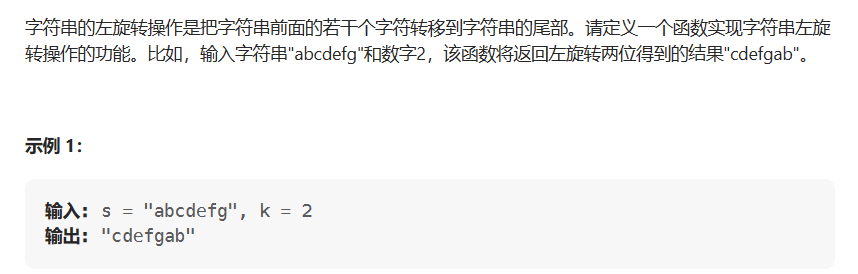

# 左旋转字符串

- 题目

[剑指 Offer 58 - II. 左旋转字符串 - 力扣（LeetCode）](https://leetcode.cn/problems/zuo-xuan-zhuan-zi-fu-chuan-lcof/description/)

- 思路

  > 使用substring()截取需要左旋转的字符串，然后再截取剩下的字符串，最后拼接。



- 代码

```java
public String solve(string s, int n) {
    String s1 = s.substring(0,n);
    String s2 = s.substring(n);
    return s2 + s1;
}
```

