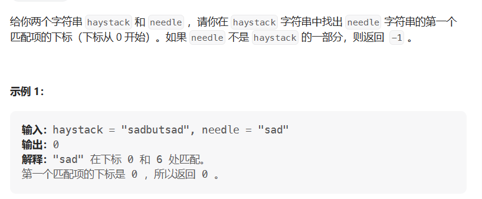

# 找出字符串中第一次出现字串的下标

- 题目

[28. 找出字符串中第一个匹配项的下标 - 力扣（LeetCode）](https://leetcode.cn/problems/find-the-index-of-the-first-occurrence-in-a-string/)

- 思想

  > 使用KMP算法进行操作



- 代码

```java
public int solve(String haystack, String needle) {
    return haystack.indexOf(needle);
}
```

