# Java核心技术卷

### 其他信息

- 查看是否使用废弃的JavaAPI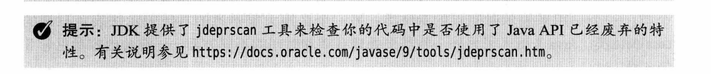

- 类图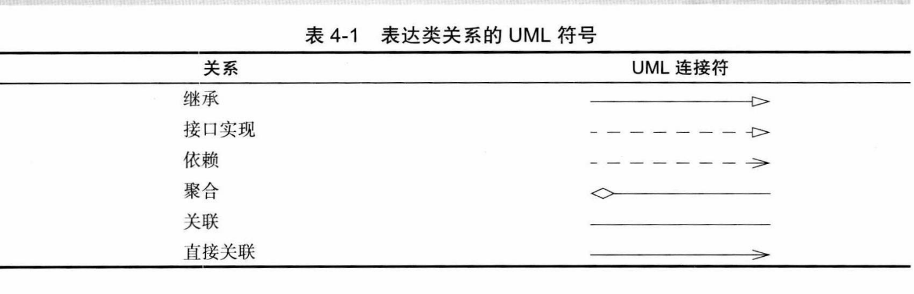

- JavaFX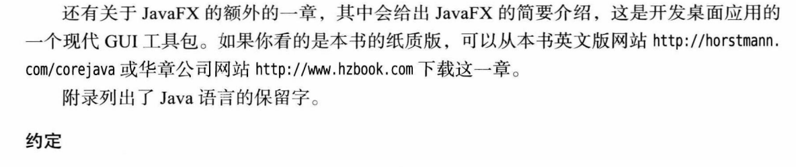

- 示例代码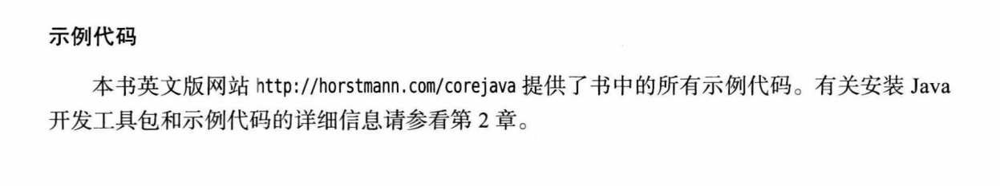

- 描述Java语言的关键术语概述

- NetBeans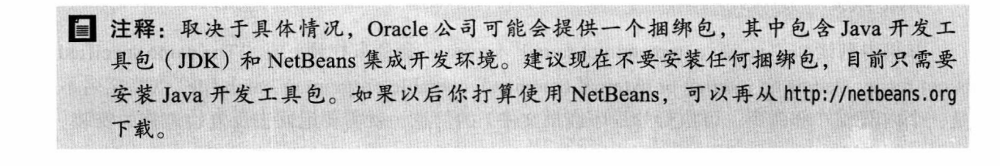

- 获取Java相关的源代码

- Java语言规范

- 不建议使用char类型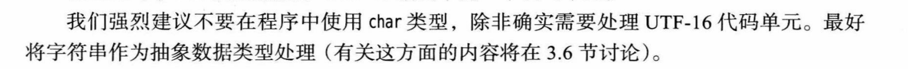

```java
1个java的char字符并不完全等于一个unicode的字符。char采用的UCS-2编码，是一种淘汰的UTF-16编码，编码方式最多有65536种，远远少于当今Unicode拥有11万字符的需求。java只好对后来新增的Unicode字符用2个char拼出1个Unicode字符。导致String中char的数量不等于unicode字符的数量
```

- 判断是否为Java字母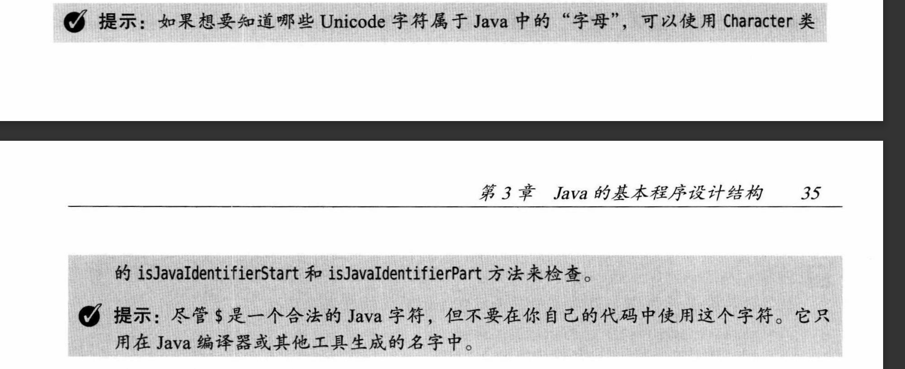

  ```JAVA
  System.out.println(Character.isJavaIdentifierPart('*'));//false
  System.out.println(Character.isJavaIdentifierStart('$'));//true
  ```

  

- 逗号运算符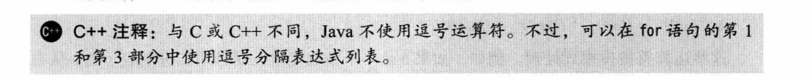

  - Java中无逗号运算符，但是可以在for语句中使用逗号分隔表达式

- 运算符优先级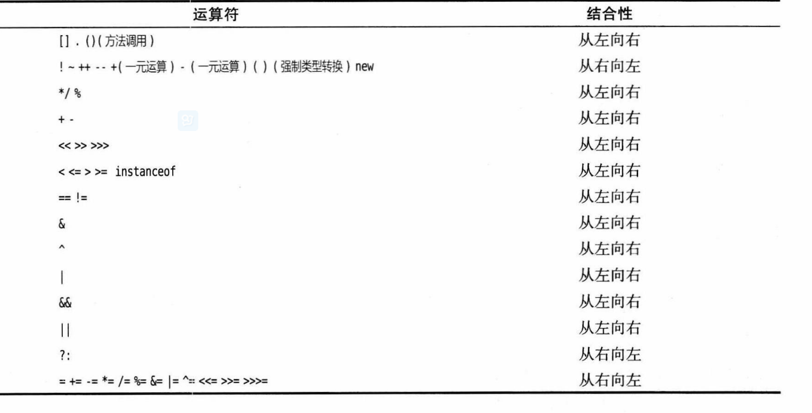

  - 先可以记住结合性为从右向左
    - ？:
    - = |=等赋值运算符

- 码点（codePoint)与代码单元
  - 常用Unicode字符码点使用一个代码单元
  - 辅助字符码点使用两个代码单元
- 方法
  - 更改器方法
  - 访问器方法

#### 经验

- 不建议返回可变对象的引用(含有更改器方法)，如果需要可以返回它的副本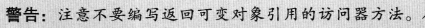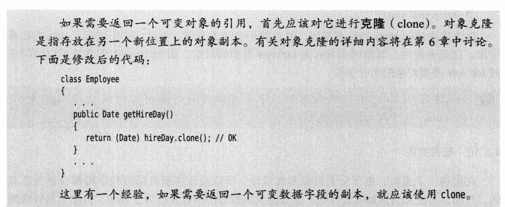

#### 特例

- 可以使用原生方法可以修改final修饰的变量的值，但不建议使用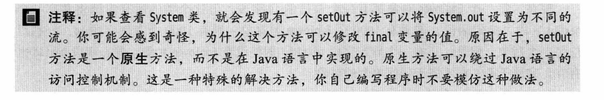

#### 方法

> Java中方法参数传递为值传递，传递值的副本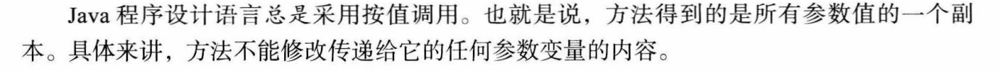
>
> 	
> 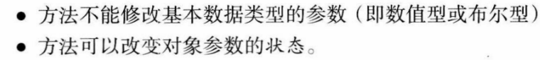
>
> - 方法签名
>
>   > 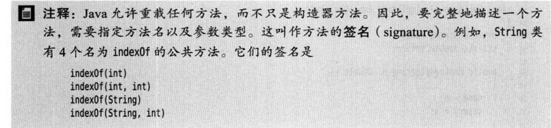
>   >
>   > 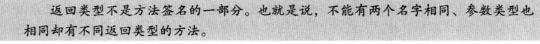

-----

#### 日期和时间

> - 转化符
>
>   >  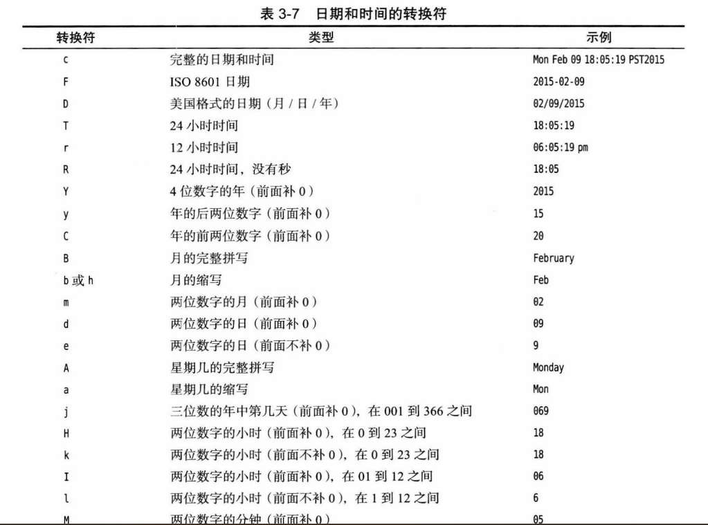
>   >
>   > 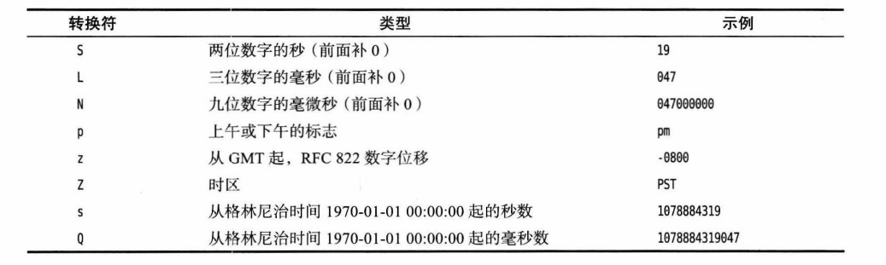

----

#### 文档注释

> 注释放在需要注释对象的前面

- 类注释
- 方法注释
- 字段注释
- 包注释

#### 类设计技巧

---

1. 一定要保证数据私有
2. 一定要对数据进行初始化
3. 不要在类中使用过多的基本类型，可以封装在额外一个类中
4. 不是所有的字段都需要单独的字段访问器和字段更改器
5. 分解有过多职责的类
6. 类名和方法名要能够体现他们的职责
7. 优先使用不可变的类