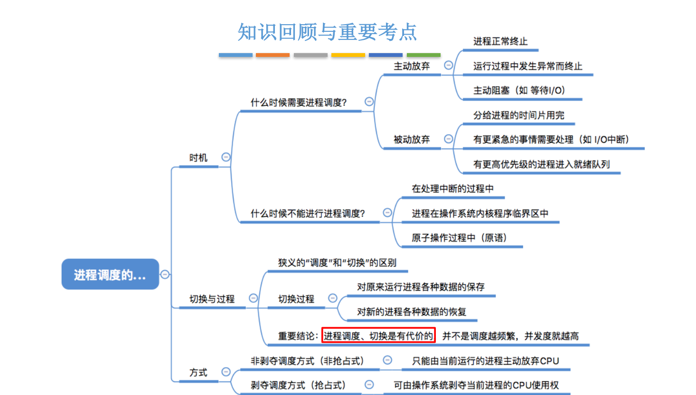
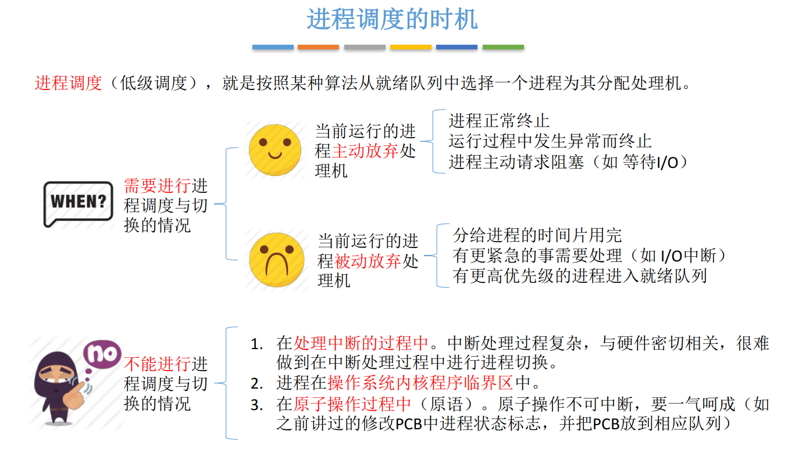
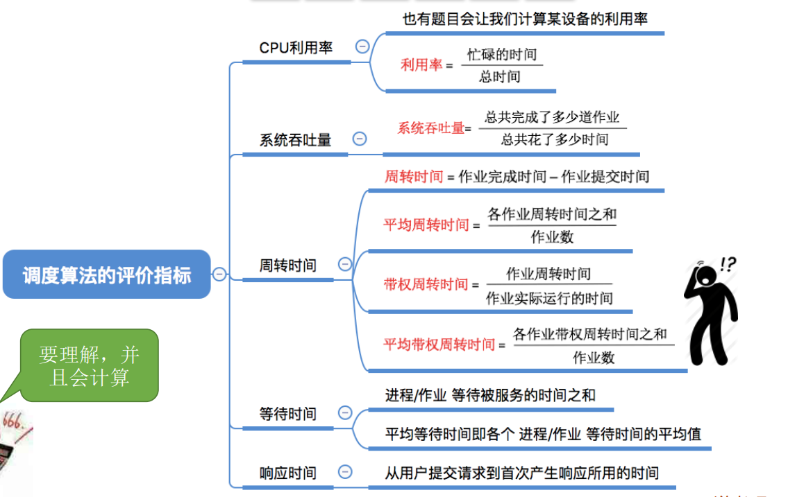
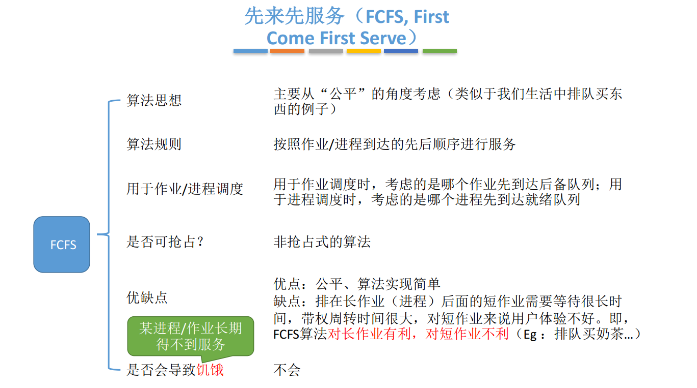
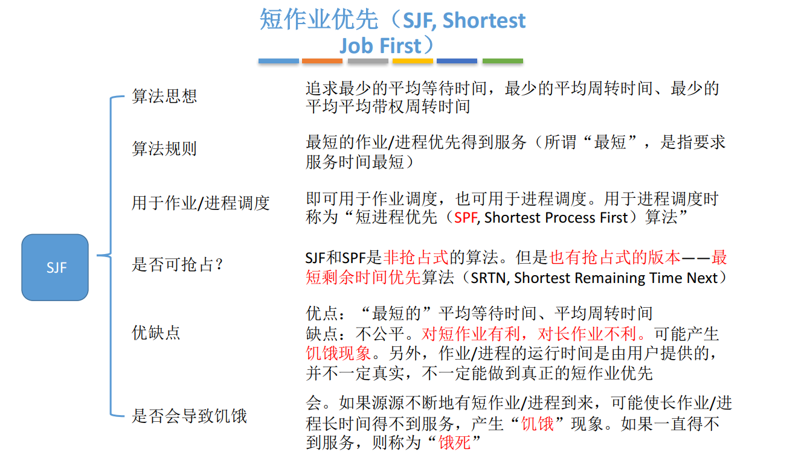
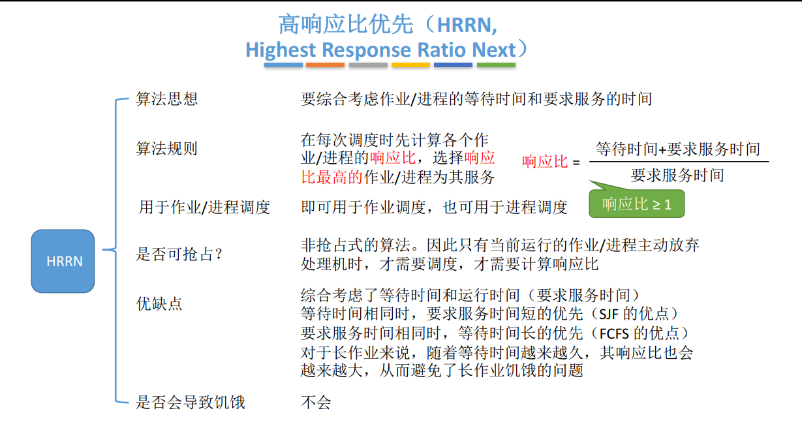

# 操作系统

- 定义

一种管理软件资源和硬件资源的系统软件

- 功能
  - 资源管理
    - 处理机管理
  - 存储器管理
    - 文件管理
    - 设备管理
  - 提供功能接口（命令接口---cmd、程序接口--系统调用）
  
- 特征
  - 并发
  - 共享
  - 虚拟
  - 异步

## 进程与线程

- 进程控制
  - 概念：将进程的状态进行转换
  - 进程状态
    - 创建态
    - 就绪态
    - 运行态
    - 阻塞态
    - 终止态
  -	实现原理：使用原语完成进程状态的转换
- 进程通信
  - 共享存储
    - 基于数据结构共享存储
    - 基于存储区共享存储
  - 管道通信
  - 消息传递
    - 直接传递
    - 间接传递
- 线程
  - 概念：轻量级进程
  - 特性
    - 同一进程的线程资源共享
    - 具有并发性
    - CPU调度的基本单位
  - 类型
    - 用户级线程
    - 内核级线程
  - 多线程模型
    - 一对一
      - 优点：并发能力强
      - 缺点：线程管理开销大
    - 多对一
      - 优点：线程管理开销小
      - 缺点：并发能力弱
    - 多对多
      - 并发能力一般，线程管理开销一般

#### 进程调度

- 进程调度时机
     - 可以进程调度
        - 主动放弃
          - 进程正常终止
          - 运行过程中方式异常而终止
          - 阻塞（等待I/O)
        - 被动放弃
          - 分给进程的时间片用完
          - 有更紧急的事情需要处理(如 I/O 中断)
          - 有更高优先级的进程进入就绪队列
            - 不能进行进程调度
        - 在处理中断过程中
        - 进程在操作系统内核程序临界区中
        - 原子操作过程中(原语)
- 进程切换过程
  - 对原来运行进程各种数据的保存
  - 对新的进程各种数据的恢复
  - 进程调度、切换是有代价的，并不是调度越频繁，并发度就越高
- 进程调度方式
  - 非剥夺调度方式(非抢占式)
    - 只能由当前运行的进程主动放弃CPU
    - 实现简单，系统开销小但是无法及时处理紧急任务，适合于早期的批处理系统
  - 剥夺调度方式(抢占式)
    - 可由操作系统剥夺当前进程的CPU使用权
    - 可以优先处理更紧急的进程，也可以实现让各进程按照时间片轮流执行的功能(通过时钟中断)，适合分时操作系统、实时操作系统

##### 调度算法评估

- CPU利用率
- 系统吞吐量
- 周转时间
- 等待时间
- 响应时间

-----------

#### 调度算法

> - 先来先服务算法(FCFS)
> - 短作业优先算法(SJF)
> - 高响应比优先(HRRN)
>
> 
>
> 
>
> 

