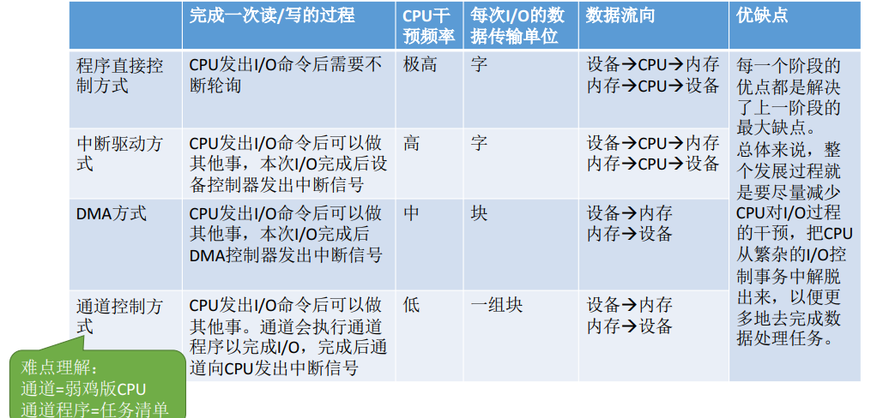

# 操作系统

#### 绪论

- 定义

一种管理软件资源和硬件资源的系统软件

- 功能
  - 资源管理
    - 处理机管理
  - 存储器管理
    - 文件管理
    - 设备管理
  - 提供功能接口（命令接口---cmd、程序接口--系统调用）
  
- 特征
  - 并发
  - 共享
  - 虚拟
  - 异步

#### 进程与线程

- 进程控制
  - 概念：将进程的状态进行转换
  - 进程状态
    - 创建态
    - 就绪态
    - 运行态
    - 阻塞态
    - 终止态
  -	实现原理：使用原语完成进程状态的转换


- 进程通信
  - 共享存储
    
    > 简单理解就是，甲和乙中间有一个大布袋，甲和乙交换物品是通过大布袋进行的，甲把物品放在大布袋里，已拿走。但乙不能直接到甲的手中拿东西，甲也不能直接到乙的手中拿东西。还有任何人在向大布袋中放东西时，其他人不能向大布袋拿东西。
    
    - 基于数据结构共享存储
    - 基于存储区共享存储
    
  - 管道通信
  
    > 从管道读取数据是一次性操作，数据一旦被读取，它就从管道中被抛弃，释放空间以便写更多的数据。管道只能采用**半双工通信**，即某一时刻只能单向传输，要实现父子进程双方互动通信，需要定义两个管道。只有写进程将缓存区写满，读进程才能开始读取缓存区的数据，当缓存区中有数据的时候，写进程不会往缓存区写数据。
  
  - 消息传递
  
    > 简单理解就是，甲要告诉乙某件事，就要写信，然后通过邮差送给乙。直接通信就是邮差把信直接送到乙的手上；间接通信就是乙家门口有一个邮箱，邮差把信放在邮箱中。
  
    - 直接传递
    - 间接传递
- 线程
  - 概念：轻量级进程
  - 特性
    - 同一进程的线程资源共享
    - 具有并发性
    - CPU调度的基本单位
  - 类型
    - 用户级线程
    - 内核级线程
  - 多线程模型
    - 一对一
      - 优点：并发能力强
      - 缺点：线程管理开销大
    - 多对一
      - 优点：线程管理开销小
      - 缺点：并发能力弱
    - 多对多
      - 并发能力一般，线程管理开销一般

进程调度


- 进程调度时机
     - 可以进程调度
        - 主动放弃
          - 进程正常终止
          - 运行过程中方式异常而终止
          - 阻塞（等待I/O)
        - 被动放弃
          - 分给进程的时间片用完
          - 有更紧急的事情需要处理(如 I/O 中断)
          - 有更高优先级的进程进入就绪队列
            - 不能进行进程调度
        - 在处理中断过程中
        - 进程在操作系统内核程序临界区中
        - 原子操作过程中(原语)
- 进程切换过程
  - 对原来运行进程各种数据的保存
  - 对新的进程各种数据的恢复
  - 进程调度、切换是有代价的，并不是调度越频繁，并发度就越高
- 进程调度方式
  - 非剥夺调度方式(非抢占式)
    - 只能由当前运行的进程主动放弃CPU
    - 实现简单，系统开销小但是无法及时处理紧急任务，适合于早期的批处理系统
  - 剥夺调度方式(抢占式)
    - 可由操作系统剥夺当前进程的CPU使用权
    - 可以优先处理更紧急的进程，也可以实现让各进程按照时间片轮流执行的功能(通过时钟中断)，适合分时操作系统、实时操作系统

调度算法评估

- CPU利用率
- 系统吞吐量
- 周转时间
- 等待时间
- 响应时间


调度算法

> - 先来先服务算法(FCFS)
> - 短作业优先算法(SJF)
> - 高响应比优先(HRRN)
>
> 
>
> 
>
> 

软硬件实现互斥的方法

> - 开/关中断指令
> - TestAndSet指令
> - Swap指令
>
> 

信号量机制

---

> wait(S) 原语---P操作 和 signal(S) 原语---V操作，可以理解成我们自己写的函数

- 整形信号量

> 不能满足让权等待原则，存在while

```c
void wait(int S) {			void signal(int S) { 
    while (S<=0);				S = S + 1;
    S = S - 1;				}
}							
```

- 记录型信号量

> 满足让权等待原则，使用 if

```c
typedef struct {					void wait(semaphore S) {      void signal(semaphore S) {
    int value;剩余资源数量				S.value--;						S.value++;
    struct process *L;等待队列	           if (S.value<0) {				if (S.value>=0) {
} semaphore;						     block(S.L);					wakeup(S.L);
    								}							}
               					  }								}
```


- 实现进程互斥

> 互斥问题信号量初始值设为1，临界资源只有一个。

- 实现进程同步

>  同步问题信号量初始值为0

- 实现进程的前驱关系

> 本质是多级同步问题，P操作可以看成一把🔒，V操作看成🔑，拿到🔑才可以解🔒


- 消费者与生产者问题

> 这是一个进程同步与互斥的综合问题。


细节

> **实现互斥的P操作一定要在实现P操作之后**，V操作不会导致进程堵塞，因此两个V操作顺序可以交换。


死锁

> 进程之间相互占有对方所需要的资源。

预防死锁

- 破坏互斥条件
- 破坏不剥夺条件
- 破坏请求和保持条件
- 破坏循环等待条件


避免死锁

>  可以采用银行家算法避免死锁。


死锁的检测和解除

> 死锁的检测就是利用资源分配图，判断是能够消除所有的边，不能消除的即存在死锁。

资源分配图


总结


#### 内存

> 程序运行前必须加载到内存中才能被CPU执行

单位

>  2 的 10 次方 = 1 k     2 的 20 次方 = 1 M   2 的 30 次方 = 1 G   
>
> 4 GB 内存的地址长度(按字节编址)为 2 的 32 次方 - 1

地址编码

- 按字节编码

  > 每个存储单元大小为一个字节

- 按字长编码

  > CPU字长为n字节，则每个存储单元大小为n字节

程序的生命周期

- 编辑源代码

- 编译源代码

  > 由编译器将源代码编译成目标模块(翻译成机器语言)

- 链接

  - 静态链接

    > 装入前链接成一个完整的装入模块(可执行文件)

  - 装入时动态链接

    > 运行时边装入边链接

  - 运行时链接

    > 运行时需要目标模块才装入并链接

- 装入

  - 绝对装入

    > 编译时产生物理地址

  - 可重定位装入(静态重定位)

    > 装入时将逻辑地址转换为物理地址

  - 动态运行时装入(动态重定位)

    > 运行时将逻辑地址转换为物理地址，需要设置重定位寄存器

总结


内存管理

- 内存空间的分配与回收

  > 操作系统如何为进程分配内存空间

- 内存空间的扩展(实现虚拟化)

  > 如何运行大于内存条大小的进程

- 地址转换

  > 如何将逻辑地址转换为物理地址

  程序装入内存的三种方式

- 内存保护

  > 如何保障各进程在内存中互不随意访问对方内存空间

  - 设置上下限寄存器
  - 利用重定位寄存器、界地址寄存器进行判断

总结


内存空间的扩充

- 覆盖技术(已过时)

- 交换技术

  > 将进程挂起，放入外存中的对换区

总结


连续分配管理

> 内部碎片 ： 分配给进程的内存空间中，进程未使用的部分  
>
> 外部碎片： 未分配的内存空间，但由于内存空间太小，所有的进程都无法使用的部分

- 单一连续分配

  - 只支持单道程序
  - 无外部碎片，有内部碎片

- 固定分区分配

  - 支持多道程序
  - 无外部碎片，有内部碎片

- 动态分区分配

  > 程序加载到内存时动态的为进程分配内存空间

  - 支持多道程序
  - 无内部碎片，有外部碎片

总结


动态分区分配算法

- 首次适应算法

  - 思想

    > 空闲分区按照低地址递增排序，每次从最低地址开始寻找满足进程的内存空间

- 最佳适应算法

  - 思想

    > 空闲分区按照分区大小递增排序，每次从最小分区开始寻找满足进程的内存空间

- 最坏适应算法

  - 思想

    > 空闲分区按照分区大小递减排序，每次从最大分区开始寻找满足进程的内存空间

- 邻近适应算法

  - 思想

    > 空闲分区按照低地址递增排序，每次从上次分配的空间开始寻找满足进程的内存空间

总结


基本分页存储管理

- 页面

  > 进程被均匀分成多个页面  

- 页表

  > 相当于一维数组  ，由页号与内存块号组成，页号相当于数组下标，内存块号相当于存储元素。页表存放再PCB中

- 逻辑地址

  > 对物理地址的抽象，便于编程人员使用物理地址

  

- 地址转换

  > 物理地址 = 页面始址 + 页内偏移量
  >
  > 页号 = 逻辑地址/页面长度  
  >
  > 页内偏移量 = 逻辑地址 % 页面长度

  

  

总结


快表的地址变换机构

> 相当于将页表中的部分页表项缓存在寄存器中，提高访问速度。


基本地址变换机构与具有块表的对比


二级页表

> 解决一级页表太大而占用大量连续地址，分配连续地址很困难

若逻辑地址为40位，页表项大小为4 B ， 页框大小为4 KB,则逻辑地址分配如下

二级页表访存分析(没有快表机构)

- 第一次访存：访问内存中的页目录表
- 第二次访存：访问内存中的二级页表
- 第三次访存： 访问目标内存单元

总结


内存分段管理

> 一个函数属于一个段

分段与分页的区别


总结


虚拟存储技术

> 将进程所需要的数据加载到内存中，不需要到放在外存中。

局部性原理

- 时间局部性

  > 一条指令由于循环可能被多次执行

- 空间局部性

  > 访问某一块存储单元，由于数据大部分分布在连续的存储单元中，因此其附近的存储单元可能也被访问

实现虚拟存储技术

- 请求分页存储管理
- 请求分段存储管理
- 请求段页式存储管理

总结


请求分页管理

> 增加缺页中断机制和页面置换功能，页表增加状态位、访问字段、修改位、外存地址这几个表项

页表


缺页中断机制

> 首先查看页表项是否在内存，若没有则发生缺页中断。将目标页面从外存调入内存中。若内存空间不足则操作系统使用页面置换功能。

总结


页面置换算法

- 最佳置换算法(Opt)

  > 理想算法，无法实现。算法思想就是淘汰内存中的内存块在未来中出现最晚的内存块。

- 先进先出置换算法(FIFO)

  > 算法思想：将使用的内存块用链式连接，淘汰队首的内存块。实现简单，但开销较大。

- 最近最久未使用置换算法(LRU)

  > 算法思想：淘汰内存中最久未使用的内存块。

- 时钟置换算法(CLOCK)

  > 算法思想：将使用的内存块用循坏队列连接，淘汰访问位是0的内存块。
  >
  > 第一轮扫描：淘汰访问位是0的内存块，并且将访问位是1的内存块修改为0。
  >
  > 第二轮扫描：淘汰访问位是0的内存块。

- 改进型的时钟置换算法

  > 改进点：增加修改位的限制，未修改的内存块不要进行页面置换，直接抛弃。
  >
  > 第一轮扫描：淘汰访问位是0，修改位是0的内存块。
  >
  > 第二轮扫描：淘汰访问位是0，修改位是1的内存块。并且将访问位是1的内存块修改为1.
  >
  > 第三轮扫描：淘汰访问位是0，修改位是0的内存块。
  >
  > 第四轮扫描；淘汰访问位是0，修改位是1的内存块。

总结


页面分配策略

- 驻留集

  > 指请求分页存储管理中给进程分配的物理块集合 。存在内存中的进程页面集合。

- 工作集

  > 再某段时间间隔里，进程实际访问页面的集合。

- 抖动(颠簸)现象

  > 页面频繁换进换出，主要原因是分配给进程的驻留集大小太小。

- 固定分配

  > 操作系统为每个进程分配固定大小的驻留集，进程运行时大小不变。

- 可变分配

  > 操作系统先为每个进程分配一定大小的驻留集，进程运行时适当增加或减少驻留集的大小。

- 局部置换

  > 发生缺页时只能选择进程自己的驻留集中页面进行页面置换。

- 全局置换

  > 操作系统将空闲页面分配给缺页进程或者将别的进程的页面置换到外存，再分配给缺页进程。
  >
  > 固定分配无法全局置换。

- 预调用策略

  > 利用空间局部性，将相临页面加载到内存中。在进程运行前使用。

- 请求调用策略

  > 进程运行时，发现缺页时调页。

总结


#### 文件

初始文件管理

- 文件的定义

> 一组有意义的信息的集合。

- 文件属性

  > 文件名、标识符、类型、位置、大小、保护信息等。

- 文件内部的组织

  > 文件内部如何将信息组织起来(文件的逻辑结构)

- 文件之间的组织

  > 指目录结构。

- 操作系统提供的文件相关功能

  > create delete open close write read 系统调用

- 文件中的信息在外存中的组织

  > 指文件的物理结构。

- 操作系统管理外存中的空闲块

  > 相当于操作系统管理内存中的空闲块。

- 其他的文件管理功能

  > 文件共享
  >
  > 文件保护

总结


文件的逻辑结构

- 无结构文件

  > 文件内部的数据就是一系列二进制流或字符流组成。又称流式文件。如 *.txt文件

- 有结构文件

  > 由一组相似的记录组成，又称记录式文件。每条记录又包含若干个数据项。如数据库的表。记录分为定长记录和可变长记录。

  - 顺序文件

    > 文件中的记录一个接一个地顺序排序(逻辑上)，记录在物理上可以顺序存储或链式存储

    - 串结构

      > 记录之间的顺序与关键字无关。(无序线性表)

    - 顺序结构

      > 记录之间的顺序按关键字顺序排序。(有序线性表)。定长记录顺序结构可以实现随机存取。

  - 索引文件

    > 实现变长记录文件的随机存取。每条记录对应一个索引表项(缺点)。

  - 索引顺序文件

    > 解决索引表可能会很大的问题。索引表项远大于文件中记录。
    >
    > 根据关键字进行分组，一个组对应一个索引表项。
    >
    > 为了进一步提高检索效率，可以为顺序文件建立多级索引表。

总结


文件目录

- FCB(文件控制块)

  > 一个文件对应一个FCB，一个FCB就是一个目录块，多个FCB组成文件目录

- 目录结构

  - 单极目录结构

  - 两级目录结构

  - 多级(树形)目录结构

    > 无法进行文件的共享。

  - 无环图目录结构

    > 解决多级目录结构文件共享的问题。

- 索引节点

  > 将文件中除了文件名的信息都存放在索引节点中，每个文件对应一个文件索引。
  >
  > 目录项中只包含文件名与索引节点，减小目录项的大小，从而减少IO的次数。

  总结

  

文件的物理结构(文件分配方式)

- 连续分配

  > 每个文件在磁盘上占有一组连续的块。

  - 优点：支持顺序访问和随机访问。顺序读写时速度最快。
  - 缺点：不方文件便扩展。存储空间利用率低，会产生磁盘碎片。

- 链接分配

  - 隐式链接

    > 相当于链表，将磁盘块链接起来。

    - 缺点：只支持顺序访问，不支持随机访问。查找效率低，指针也消耗空间。
    - 优点：方便文件扩展。无碎片问题，磁盘利用率高。

  - 显示链接

    > 为磁盘色设置一张FAT。一个磁盘仅设置一张FAT，开机时，将FAT读入内存，并且常驻内存。

    - 优点：隐式链接优点+地址转换时不需要访问磁盘，因此文件的访问效率更高。
    - 缺点：FAT(文件分配表)需要占用一定的存储空间。

    

- 索引分配

  > 为每个文件建立一张索引表。

- 索引分配总结


总结


文件的基本操作

- 创建文件(create系统调用)
- 删除文件(delete系统调用)
- 读文件(read系统调用)
- 写文件(write系统调用)
- 打开文件(open系统调用)
- 关闭文件(close系统调用)

总结


文件共享

- 基于索引节点的共享方式(硬链接)

  索引节点中的Count记录文件的引用个数，只用count为零时文件才被删除。

  

- 基于符号链的共享方式(软链接)

  > 类似于Windows的快捷方式，根据记录的文件路径层层查找目录，磁盘IO操作过多，效率比硬链接低。

总结


文件保护

- 口令保护

  > 口令保存在文件对应的FCB或索引节点中。

  优点：保存口令的空间开销不多，验证口令的时间开销也很小。

  缺点：正确的口令存放在系统内部，不够安全。

- 加密保护

  > 使用加密软件对文件进行加密。

  优点：保密性强，不需要在系统中存储秘密。

  缺点：编译/译码，或者说加密/解密需要花费一定时间。

- 访问控制

  > 在每个文件的FCB或索引节点中添加一个访问控制列表(ACL)，表中记录每位用户对文件的权限。


总结


#### IO

I/O设备组成

- 机械部件
- 电子部件

I/O控制器

> I/O设备的电子部件，又称设备控制器，用于实现CPU对设备的控制。

功能

- 接收和识别CPU发出的命令
- 向CPU报告设备的状态
- 数据交换
- 地址识别


组成

- CPU与控制器的接口
- I/O逻辑
- 控制器与设备的接口


寄存器编制方式

- 内存映射I/O

  优点：简化指令。

- 寄存器独立编制

  缺点：操作麻烦。


总结


I/O控制方式

> 1. 完成一次读/写操作的流程
> 2. CPU干预的频率
> 3. 数据传送的单位
> 4. 数据的流向
> 5. 优点与缺点

- 程序直接控制方式

  

  2. CPU干预的频率很频繁，在等待I/O完成的过程中 CPU需要不断地轮询检查I/O设备状态。
  3. 每次读/写一个字
  4. 读操作：I/O设备--->CPU--->内存  写操作：内存--->CPU--->I/O设备
  5. 优点：实现简单(读/写指令+循环检查的一系列指令)
  6. 缺点：CPU与I/O设备只能串行工作，CPU需要一直轮询检查，长期处于忙等状态，CPU利用率低

- 中断驱动方式

  程序直接控制方式引入中断技术，实现I/O完成的过程中CPU可以切换到别的进程执行，让CPU和I/O设备可以并行工作。

  缺点：频繁的中断处理会消耗较多的CPU时间，降低系统性能。

- DMA方式(直接存储器存取)

  

  1. 每次读/写一个或多个连续块
  2. 仅在传送一或多个连续块的数据的开始和结束时，才需要CPU干预
  3. 写操作：内存--->I/O设备  读操作：I/O设备--->内存
  4. 优点：数据传送速率增加，CPU与I/O设备并行性提高。
  5. 缺点：处理离散的数据块时，CPU要发出多条I/O指令，进行多次中断处理才能完成。

- 通道控制方式

  通道：一种硬件，相当于弱鸡版CPU，可以识别并且执行一系类通道指令。

  

  1. 每次读/写一组数据块
  2. 缺点：实现复杂，需要专门的通道硬件支持
  3. 优点：解决了DMA方式处理离散数据块CPU多次干预的问题，资源利用率提高。

- 总结



