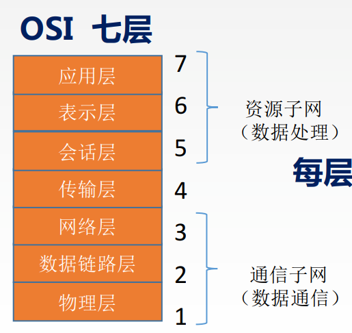
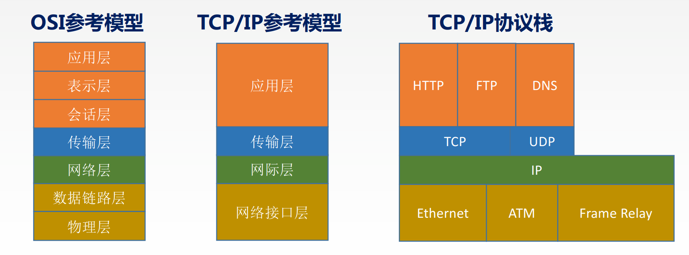
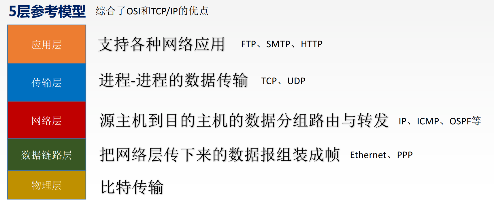
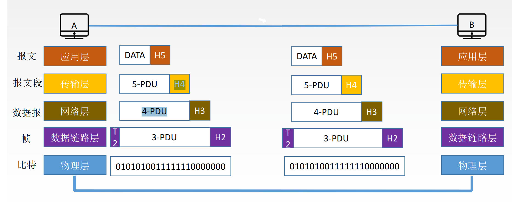
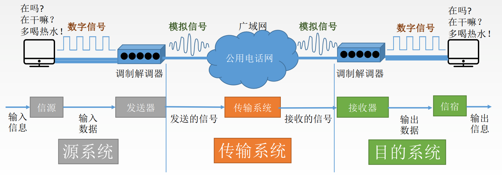
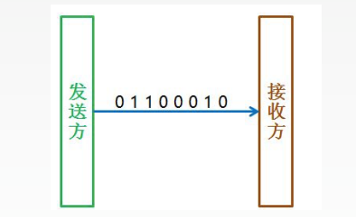
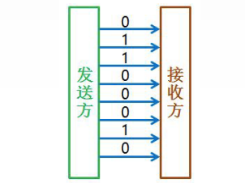
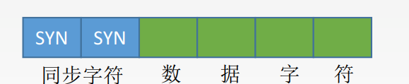

# 计算机网络

## 绪论

性能指标

- 速率

- 带宽

  > 网络设备所支持的最高速度

- 吞吐量

  > 表示在单位时间内通过某个网路的数据量

- 时延

  > 1. 传输时延
  > 2. 传播时延
  > 3. 排队时延
  > 4. 处理时延

- 时延带宽积

  > 表示以比特为单位的链路长度
  >
  > 时延带宽积 = 传播时延 * 带宽

- 往返时间RTT

- 利用率

OSI七层模型

- 应用层

  > 所有能和用户交互产生网路流量的程序

- 表示层

  > 将数据格式转换或数据加密或数据压缩和恢复

- 会话层

  > 与每个主机建立一次会话

- 传输层

  > 负责两个进程的通信

- 网络层

  > 将分组从源端传到目的端，传输单位是数据报

- 数据链路层

  > 将网络层的数据报组装成帧

- 物理层

  > 传输单位是比特

TCP/IP模型

5层参考模型

## 物理层

数据通信基础知识

- 数据通信模型

  > 1. 信息：指语音、文字、图像、视频等
  > 2. 数据：信息的01形式
  > 3. 信号：数字信号与模拟信号
  > 4. 信源：发送信息的主机
  > 5. 信宿：接收信息的主机
  > 6. 信道：信号传输的媒介。模拟信道、数字信道、无线信道、优先信道。

  

- 通信方式

  

  - 单工通信

    > 只有一方可以发送消息，一方接收消息。

  - 半双工通信

    > 双方都可发送和接收消息，但是同时只能一方发送消息，另外一方接收消息。

  - 全双工通信

    > 双方可以同时发送和接收消息。

  - 串行传输

    > 数据的01以一个一个比特的发送。

    

  - 并行传输

    > 数据的01全部一起发送。

    

  - 同步传输

    > 数据传送以一个数据区块为单位，先送出1个或多个同步字符，再传输整批数据。

    

  - 异步传输

    > 数据的传输断断续续